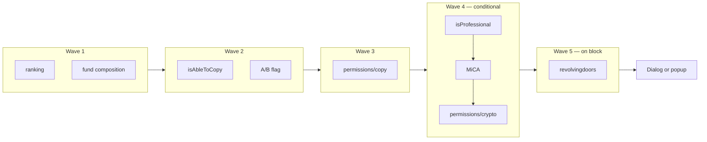
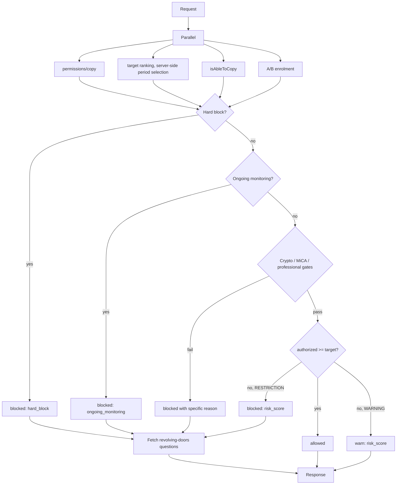

# Suitability Test — BFF contract proposal

A proposal, not a decision. Derived from [product.md](product.md) and [tech.md](tech.md).

**Position up front:** the modern suitability path is already mostly server-side, so the case for a BFF here is **not** about moving scoring logic — that battle is won. It is about the **copy-intent fan-out**, where the client makes six to nine sequential and parallel calls before it can open a copy dialog, and about **removing the one piece of decision logic still stranded in the browser**: the `authorizedRiskScore >= target.RiskScore` comparison. If you only do one thing from this document, do endpoint 1.

---

## 1. Current call inventory at copy intent

Reconstructed from `portfolio-action-events.service.ts`, `compliance-trading-flows.service.ts` and `compliance-suitability.service.ts` `[code]`.

| # | Call | Purpose | Blocking? |
|---|---|---|---|
| 1 | `GET /sapi/rankings/...` (user ranking) | Fetch the **target's** risk score for the comparison | yes |
| 2 | fund composition check | Does the target hold crypto | yes |
| 3 | `GET /sapi/kyc/api/v1/users/{gcid}/isAbleToCopy` | Legacy gate + first-copy terms + ASIC metadata | yes |
| 4 | `GET /sapi/kyc/api/v1/compliance/abtesting/{gcid}?experimentName=NewSuitability2022` | Which path to take | yes |
| 5 | `GET /sapi/kyc/compliance/users/{gcid}/{acct}/accounts/{cid}/permissions/copy` | **The suitability decision** | yes |
| 6 | `GET /sapi/kyc/compliance/real/accounts/{realCID}/isProfessional` | Professional-copy gate | conditional |
| 7 | MiCA document check | Regulatory document gate | conditional |
| 8 | `GET .../permissions/crypto` | Crypto cascade when the target holds crypto | conditional |
| 9 | `GET .../revolvingdoors/copy` | Which questions to reopen | only after a block |

Calls 1–2 and 3–4 are parallelised; 5 waits on 4; 6–8 are conditional and sequential. **Worst case is five sequential round trips** before the user sees anything.



Everything in waves 2–5 is the **same backend domain** (`/sapi/kyc/compliance/...`), reached by four separate round trips from the browser. That is the inefficiency.

---

## 2. Client-side logic that should move

| Logic | Where today | Move? | Why |
|---|---|---|---|
| `authorizedRiskScore >= target.RiskScore` | `compliance-suitability.service.ts:256` `[code]` | **Yes** | The only decision left in the browser. It forces the client to fetch the target's ranking purely to compare two numbers, and it means a client bug can permit a non-compliant copy. |
| Choosing block versus warn from `restrictionType` | same file, 274–294 | **Yes** | Presentation should follow a server-issued outcome, not re-derive it |
| Which popup variant to render | same | No | Genuine presentation |
| Ranking period selection (`riskScorePeriod` CCM) | `compliance-trading-flows.service.ts:1094` | **Yes** | The client should not decide which risk-score period is compliant |
| A/B branch between legacy and modern | `compliance-trading-flows.service.ts:860` | **Yes** | The server knows the enrolment; the client should receive an outcome, not a strategy |
| Crypto / MiCA / professional sequencing | `compliance-suitability.service.ts:104-115` | **Yes** | Pure orchestration, no UI input |
| Revolving-doors deep link construction | 339–361 | Partly | Server should return the question IDs *and* the intended deep link |

---

## 3. Proposed endpoints

### 3.1 `GET /bff/v1/copy/eligibility`

The one that matters. Answers "may this user copy this specific target, and if not, what do we show them" in a single call.

**Replaces** calls 1, 2, 3, 4, 5, 6, 7, 8 and 9 from §1.

**Request**

| Param | Type | Required | Notes |
|---|---|---|---|
| `targetType` | `user` \| `portfolio` | yes | |
| `targetId` | string | yes | CID or portfolio id |
| `accountType` | `real` \| `demo` | yes | |
| `intendedAmount` | number | no | Enables a forward-looking ongoing-monitoring check |

**Response**

```jsonc
{
  "decision": "allowed" | "warn" | "blocked",
  "reason": null | "hard_block" | "risk_score" | "ongoing_monitoring"
          | "professional_only" | "crypto_restricted" | "mica_document" | "first_copy_terms",
  "riskScore": { "authorized": 6, "target": 8 },      // omit target when not applicable
  "presentation": {
    "popupKey": "suitability.popup.riskScoreBlock",
    "params": { "riskScore": 8, "limit": 6, "userName": "..." },
    "canOverride": false,                              // true only for warn
    "remediation": {
      "available": true,
      "deepLink": "/kycx/flow/copy-flow?questions=9,10",
      "questionIds": [9, 10]
    }
  },
  "firstCopy": { "required": true, "terms": [ /* ... */ ] },
  "evaluatedAt": "2026-08-09T09:00:00Z"
}
```

**Orchestration**



**Benefit.** Five sequential round trips collapse to one. On a 150 ms RTT that is roughly **750 ms → 150 ms** of network time; server-side the four upstream calls parallelise against the same datacentre, so the added server cost is bounded by the slowest single upstream rather than their sum. `[inferred]` — estimated from the call graph, not measured.

**Errors**

| Condition | Response |
|---|---|
| `permissions/copy` fails | `503` — the client must **not** fall back to allowing |
| Ranking fails but permissions succeed and the user is hard-blocked | `200` with `blocked / hard_block`; the target's score is irrelevant |
| Ranking fails and the decision needs it | `503`, `retryable: true` |
| Revolving-doors fails | `200` with `remediation.available: true` and `questionIds: [1]`, matching today's fallback |
| Target not found | `404` |

**Partial failure.** The rule is that a decision is only returned when every gate that could *deny* has been evaluated. A failed *enrichment* (a popup parameter, a display name) degrades the presentation block but not the decision. A failed *gate* returns `503`. This preserves the current fail-closed posture, which is the correct one for a regulatory control.

### 3.2 `GET /bff/v1/copy/profile`

For surfaces that need the user's own standing without a specific target: the Discover page, portfolio, settings.

**Replaces** the ad-hoc `copySuitability` payload embedded in Discovery Facade responses, giving one authoritative shape.

```jsonc
{
  "status": "unrestricted" | "disclaimer" | "risk_restricted" | "blocked" | "monitoring_blocked",
  "authorizedRiskScore": 6,
  "disclaimer": { "show": true, "remainingAttempts": 3, "textKey": "discovery.suitabilityDisclaimer.people" },
  "discoveryFilter": { "maxRiskScore": 6, "resultsQuery": "MaxMonthlyRiskScoreMax=6" },
  "remediation": { "available": true, "deepLink": "..." },
  "lastEvaluatedAt": "2026-08-09T03:00:00Z"
}
```

`remainingAttempts` is the natural home for the unknown *X* from **OQ-1**. Specifying this endpoint forces that number to be pinned down, which is a side benefit worth having.

### 3.3 `GET /bff/v1/copy/profile/explanation`

Optional, and deliberately last. Returns *why* the user has the profile they have — which components scored what — for a "why am I restricted?" surface.

This has a compliance dimension that outweighs the engineering one: exposing per-component scores tells a user precisely which answer to change to unlock higher-risk copying. Options suitability already treats this as a risk and gates answer changes behind a reasoning form and manual review. **Do not build this without a compliance position.** Listed for completeness, recommended as out of scope.

---

## 4. Shared models

```ts
type CopyDecision = 'allowed' | 'warn' | 'blocked';

type CopyRestrictionReason =
  | 'hard_block'          // server 100
  | 'risk_score'          // server 101
  | 'ongoing_monitoring'  // server 102
  | 'professional_only'
  | 'crypto_restricted'
  | 'mica_document'
  | 'first_copy_terms';

interface Remediation {
  available: boolean;      // false where the regulation hides the CTA
  deepLink?: string;
  questionIds?: number[];
}

interface RiskScorePair {
  authorized: number;      // 3 | 6 | 8 | 10 today, but treat as an open int
  target?: number;         // 1..10
}
```

`authorized` must be typed as a plain number, not a union of `3 | 6 | 8 | 10`. Those values come from `RiskLevelToScoreMappings` in Cosmos and change by configuration deploy. Encoding them in a client type would make a config change a breaking client change.

---

## 5. Migration checklist

1. Stand up `/bff/v1/copy/eligibility` alongside the existing calls; do not change the client yet.
2. Shadow-run: for a sample of copy intents, compute the BFF decision server-side and log agreement with the client's decision. Do not act on it. Target 100% agreement before proceeding — this is a regulatory control and a silent divergence is a compliance incident.
3. Move `riskScorePeriod` selection server-side first. It is a one-line client change and removes a compliance-relevant decision from the browser.
4. Switch the client to the BFF decision behind a flag, keeping the local comparison as a shadow check that only logs on disagreement.
5. Remove the client-side comparison and the target-ranking fetch from the copy path once agreement holds.
6. Add `/bff/v1/copy/profile`; migrate Discover off the embedded `copySuitability` payload.
7. Retire the client A/B branch — the BFF resolves it internally.
8. Delete the legacy `kyc/` suitability path once **OQ-8** confirms no production regulation still reaches it.

Steps 1–3 are safe and independently valuable. Step 5 is the one that needs the shadow-run evidence from step 2.

---

## 6. What this does not fix

- **Ongoing monitoring is still a daily batch.** A BFF cannot make a next-day recalculation feel immediate. If the perceived latency of "I updated my answers and I'm still blocked" is the real problem, the fix is an on-demand recalculation trigger, not a BFF.
- **The scoring formula stays in Cosmos.** Correctly so. Nothing here should move formula logic into a BFF, which would fragment a regulated control across two services.
- **Analytics coverage.** The BFF makes the *decision* observable server-side, which is a genuine improvement over today's blind spot, but it does not tell you what the user *did* with the popup. Client events are still needed — **OQ-7**.
