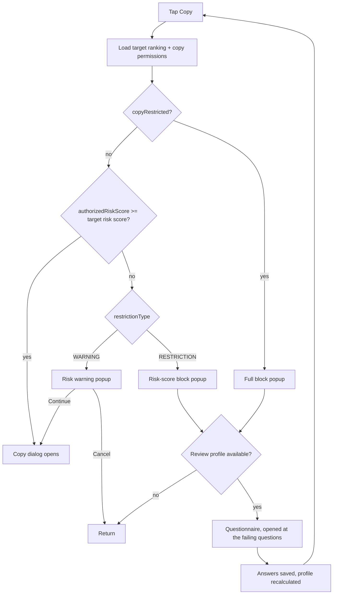
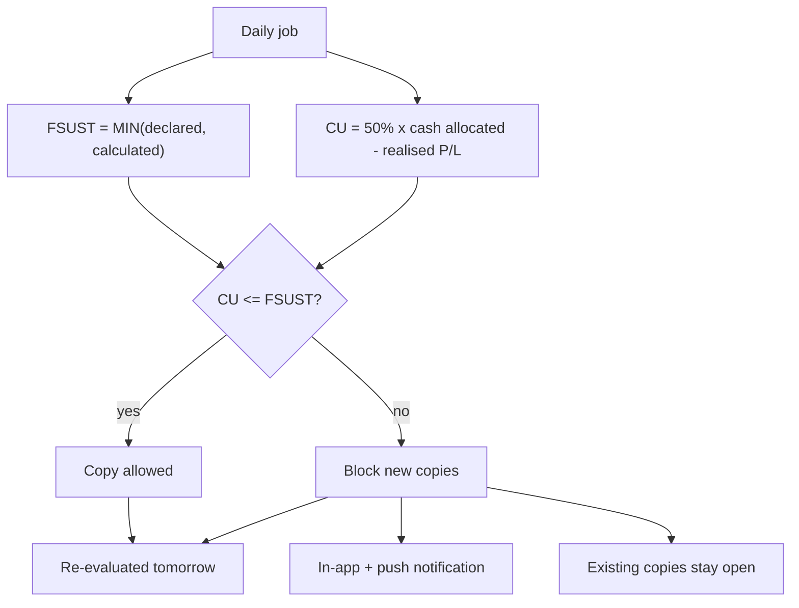
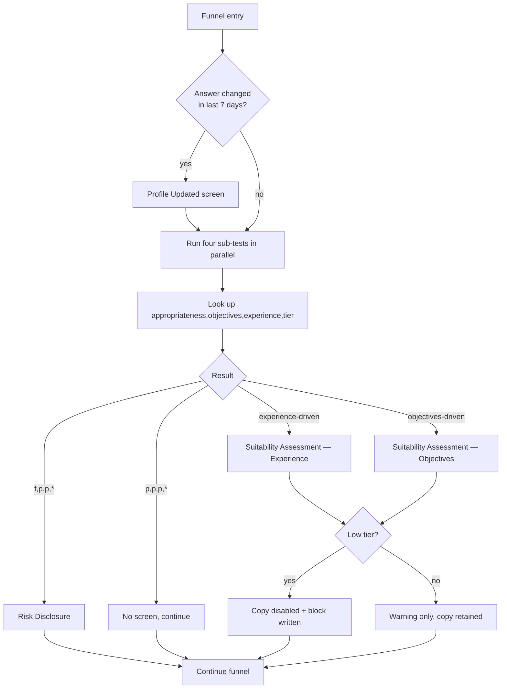

# Suitability Test — product behaviour

User-facing behaviour of the copy-trading suitability test. Intended as input to `speckit.specify`. Formulas and contracts live in [tech.md](tech.md).

| | |
|---|---|
| Feature | Suitability Test for CopyTrader and Smart Portfolios |
| Source | `etoro-assets` @ `ffdd803a37` — `kyc/`, `etoro/libs/compliance/`, `etoro/libs/discovery/` |
| Live since | June 2022 (Suitability 2022); legacy path still shipped behind an A/B flag |
| Screenshots | none supplied — screen copy transcribed verbatim in §5 |

---

## 1. Executive summary

Before a user may copy another trader or invest in a Smart Portfolio, eToro checks whether copying is suitable for them, based on answers they already gave in the Experience & Objectives questionnaire. The check produces a personal risk profile that determines the **maximum risk score** the user is allowed to copy — so a cautious user is not banned outright, but is limited to lower-risk traders and portfolios, and sees a Discover page filtered to only what they can actually copy. A small number of users with both very low risk tolerance and weak financial standing are blocked from copying entirely, and separately, users whose money committed to copies outgrows what their declared finances can sustain are stopped from opening **new** copies until the balance recovers.

The user never sees a score, a formula, or an explanation of which answer caused the outcome. They see a popup at the moment they try to copy.

---

## 2. The four outcomes

Verbatim from `Experience and Objectives questionnaire` `[confluence]`: *"There are 4 potential statuses after a client completes the questionnaire and reaches the V2 verification stage."*

| # | Status | What the user can do | What they see |
|---|---|---|---|
| 1 | **No limitation** | Copy any trader or portfolio | Nothing |
| 2 | **Copy with a disclaimer** | Copy anything, but a disclaimer appears on the first *X* attempts | Disclaimer banner |
| 3 | **Risk-score restricted** | Copy only targets at or below their authorised risk score | Block popup on higher-risk targets; a Discover page filtered to copyable targets only |
| 4 | **Fully blocked** | Cannot copy at all | Block popup |

Status 3 is the common non-default outcome and the main reason the 2022 rewrite happened — *"we were able to offer our low risk profile users, the option to copy people/portfolios with a lower risk score, as opposed to the previous formula that forced us to block them from all copy activities"* `[confluence]` `CopyTrading new suitability test`.

**The value of *X* is unknown.** The placeholder appears literally in the authoritative page and is filled in nowhere — not in Confluence, not in CCM defaults, not in the client, which reads a server-supplied `showDisclaimer` boolean with no counter `[code]`. Raised as **VQ-1**.

A fifth outcome sits alongside these: **blocked by ongoing monitoring**, applied daily when committed copy capital exceeds declared financial sustainability. It blocks new copies only and never closes existing ones.

---

## 3. What is actually asked

Eight questions feed the risk profile; two more feed the hard block; three feed ongoing monitoring. All of them already exist in the Experience & Objectives questionnaire — **the suitability test asks no questions of its own**. There is no separate "suitability questionnaire" a user sits down to take.

| Feeds | Question, in the user's words | Answer options |
|---|---|---|
| Profile | How often have you traded **stocks**? | Never / 0–10 times / 10–20 / above 20 |
| Profile | How often have you traded **crypto**? | same |
| Profile | How often have you traded **leveraged CFDs**? | same, plus 10–40 and above 40 |
| Profile | How much have you invested in stocks / crypto / CFDs? | Never / $1–500 / $500–2,000 / above $2,000 |
| Profile | What relevant financial knowledge do you have? | Professional certificate / academic degree / trading courses / none |
| Profile | How long do you typically hold a position? | Seconds to 24h / weeks to months / more than several months |
| Profile | What is your primary purpose for trading? | Short-term returns / additional revenues / future planning / saving for a home |
| Profile | What gain and loss are you comfortable with? | 5%/−3% · 10%/−6% · 20%/−12% · 40%/−24% · 80%/−48% |
| Profile | What are your main sources of income? | Salary / investments / savings / inheritance / pension / social security / severance / family support / other |
| Profile | Complex-products knowledge assessment | Multi-select statements about leverage, margin, CFDs, stop-loss |
| Hard block | What is your net annual income? | Up to $10K / $10–50K / $50–200K / $200–500K / $500K–1M / $1–5M |
| Hard block | What are your total cash and liquid assets? | same bands |
| Monitoring | How much do you plan to invest over the coming year? | Up to $20K / $20–50K / $50–200K / $200–500K / $500K–1M / above $1M |

**The single highest-leverage answer is risk appetite.** Because it sits in a `MIN` alongside purpose-of-trading, and purpose never scores below `Medium`, selecting the lowest risk-reward band (5%/−3%) caps the entire profile at `Low` and the authorised risk score at 3 — irrespective of every other answer. See [tech.md](tech.md) §4.3.

Two answers are quietly inert: **stock invested-amount scores identically at every band**, and **purpose-of-trading can only ever contribute `Medium`, `MediumHigh` or `High`**, never the lowest levels.

---

## 4. User journeys

### J1 — Copy attempt, user is restricted by risk score

**Entry point:** user taps Copy on a trader or Smart Portfolio.
**Preconditions:** logged in, real account, verification level 2 reached, Experience & Objectives answered.

1. The app loads the target's ranking to get its risk score.
2. In parallel it asks the server for the user's copy permissions.
3. The server returns `authorizedRiskScore` and whether copy is restricted.
4. The app compares the target's risk score to the authorised score.
5. Target is higher → a popup explains the user cannot copy this trader at their risk level.
6. The popup offers **Review profile**, which opens the questionnaire at the specific questions that drove the outcome.
7. If the user changes an answer, the profile is recalculated and the new limit applies immediately.

**Exit:** copy dialog opens (allowed), or the user is returned to the previous screen (blocked), or the user enters the questionnaire.

**Acceptance**

- **Given** a user with authorised risk score 6, **when** they attempt to copy a trader with risk score 8, **then** a restriction popup is shown and no copy position is created.
- **Given** the same user, **when** they attempt to copy a trader with risk score 6, **then** the copy dialog opens normally.
- **Given** a restricted user, **when** the popup is shown and the user's regulation is not in `disableReviewProfileButtonOnSuitabilityPopupForRegulations`, **then** a **Review profile** CTA is present.
- **Given** a user who changes their risk-appetite answer to a higher band, **when** the profile is recalculated, **then** the new authorised score applies to their next copy attempt without re-login.

### J2 — Copy attempt, user is fully blocked

**Entry point:** same as J1. **Preconditions:** all four hard-block conditions true.

1. The user taps Copy.
2. Permissions return `copyRestricted: true`.
3. A block popup states that copy trading is unavailable, with no risk-score nuance.
4. **Review profile** opens the questionnaire at the failing questions.
5. Answers change → recalculation → the block lifts automatically if the user no longer meets all four conditions.

**Exit:** the user leaves, or enters the questionnaire.

**Acceptance**

- **Given** a user meeting all four hard-block conditions, **when** they attempt any copy, **then** they are blocked regardless of the target's risk score.
- **Given** a blocked user who raises their declared liquid assets above $200K, **when** the profile recalculates, **then** the block lifts without CS involvement.
- **Given** a blocked user with insufficient answers to evaluate the block, **when** recalculation runs, **then** the previous result is retained rather than recomputed.

### J3 — Blocked by ongoing monitoring

**Entry point:** a nightly job, not a user action.

1. Daily, the system computes financial sustainability and copy utilisation.
2. Utilisation exceeds sustainability → the user is blocked from opening **new** copies.
3. The user receives an in-app notification and a push notification.
4. Existing copies continue untouched and are never closed.
5. The user may still edit and close existing copies.
6. The block lifts on a later daily run, once utilisation falls back below sustainability — by realising gains, reducing allocation, or declaring higher income or net worth.

**Exit:** block lifts on a subsequent daily run.

**Acceptance**

- **Given** a monitored user whose utilisation exceeds sustainability, **when** the daily job runs, **then** they are blocked from new copies and both notifications are sent.
- **Given** that user, **then** existing copy positions remain open.
- **Given** that user updates their KYC answers today, **when** they retry today, **then** the block persists — recalculation happens on the next daily run.
- **Given** utilisation falls below sustainability, **when** the next daily run completes, **then** copy access is restored automatically.

### J4 — Legacy path: assessment during the KYC funnel

Runs only where the A/B flag is off. Unlike J1–J3, the assessment interrupts the KYC wizard rather than the copy action.

1. The user enters a funnel — copy attempt, deposit, withdrawal or "complete your profile".
2. If any answer changed in the last 7 days, a **Profile updated** screen appears first.
3. Four sub-tests run: appropriateness, objectives, experience, financial tier.
4. The results select one of four assessment screens, or none.
5. On disclosure screens the user must open and confirm both the educational-tools and risk-warnings documents before continuing.
6. The result is written back and copy access is blocked or unblocked accordingly.

**Acceptance**

- **Given** a user passing all sub-tests, **when** the assessment runs, **then** no screen is shown and the funnel continues.
- **Given** a low-tier user failing the assessment, **when** it completes, **then** a copy block is applied with KYC reason `8`.
- **Given** a high-tier user failing the assessment, **when** it completes, **then** a disclosure screen is shown but copy access is **not** blocked.
- **Given** a previously-blocked user who now passes, **when** the assessment completes, **then** the block is removed and a congratulations screen is shown.

---

## 5. Screens and copy

English strings for the legacy screens, from the production locale file `[code]`. Modern popup strings are remote i18n keys and are **not** in the repository.

| Screen | Title | Key message |
|---|---|---|
| Risk Disclosure | *Please Note* | *"You should understand that etoro products are complex derivative products and can carry a high degree of risk to your capital and may not be appropriate for you, based on your knowledge and experience as indicated by you."* |
| Suitability Assessment — Experience, high tier | *Suitability Assessment* | *"CopyTrading may not be suitable… we might choose to limit your Copy trading activity."* |
| Suitability Assessment — Experience, low tier | *CopyTrading notification* | *"copy trading may not be suitable for you and is currently disabled in your account."* |
| Suitability Assessment — Objectives, high tier | *Suitability Assessment* | Same warning wording as experience/high |
| Suitability Assessment — Objectives, low tier | *CopyTrading notification* | Same disabled wording as experience/low |
| Failed general | *CopyTrading Notification* | Two columns — **YOU CAN** *Trade on your own* / **YOU CAN'T** *Copy other traders*. Existing copy trades remain editable. |
| Passed | *Suitability Assessment* — *Congratulations!* | The user may now copy other traders |
| Profile Updated | *Profile Updated!* | Confirm the updated information is accurate |

The only wording difference between the high-tier and low-tier variants is *"we might choose to limit"* versus *"is currently disabled"*. Everything else on the screens is identical.

Modern popups `[code]` `etoro/libs/compliance/.../suitability-popup.component.ts:71-72`, keyed `suitability.popup.{root}.{title|content|submit}`:

| Root | Shown when | Behaviour |
|---|---|---|
| `block` | Fully blocked | Dismiss only |
| `riskScoreBlock` | Target risk above the cap, type RESTRICTION | Interpolates `{riskScore, limit}` |
| `riskWarning` | Target risk above the cap, type WARNING | Interpolates `{userName}`; submit continues the copy |
| `copyProfessionalRestriction` | Non-professional copying a professional | Dismiss only |

Discover disclaimers `[code]` `etoro/libs/discovery/.../copy-disclaimer/`: `discovery.suitabilityDisclaimer.people`, `.smartportfolios`, `.here`, plus `...UserCannotCopy` variants. Visibility is entirely server-driven via `copySuitability.showDisclaimer` from the Discovery Facade — there is no client-side counter.

---

## 6. Functional requirements

**Evaluation**

- **FR-001** The system computes a client risk profile from the eight Experience & Objectives components.
- **FR-002** The profile maps to a single authorised risk score of 3, 6, 8 or 10.
- **FR-003** A user may copy any person or portfolio whose risk score is at or below their authorised score.
- **FR-004** A user meeting all four hard-block conditions simultaneously is blocked from all copy.
- **FR-005** Where answers are insufficient to evaluate the hard block, the previous result is retained, not recomputed.
- **FR-006** Where a component's questions are unanswered, the default risk level `Medium` applies.
- **FR-007** The profile is recalculated on: answer change, regulation change, country change, reaching verification level 2, manual trigger, or bulk recalculation.
- **FR-008** Each recalculation is logged with its trigger reason and retained for one month.

**Enforcement**

- **FR-009** Suitability is evaluated at copy intent, before the copy dialog opens.
- **FR-010** A restricted user attempting a higher-risk target sees a popup and no position is created.
- **FR-011** Where restriction type is WARNING rather than RESTRICTION, the user may proceed after acknowledging.
- **FR-012** Restricted users are offered a remediation CTA that opens the questionnaire at the questions that caused the outcome, except in regulations configured to hide it.
- **FR-013** Discover surfaces are filtered server-side to targets the user can copy, with a disclaimer.
- **FR-014** Blocks lift automatically on recalculation; no CS action is required except for admin-applied blocks.

**Ongoing monitoring**

- **FR-015** Copy utilisation is compared against financial sustainability once per day.
- **FR-016** Users exceeding sustainability are blocked from opening new copies only.
- **FR-017** Existing copy positions are never closed by this block.
- **FR-018** Affected users receive an in-app and a push notification.

**Availability and failure**

- **FR-019** The test applies only from verification level 2 onward.
- **FR-020** Where the permissions call fails, copy is denied.
- **FR-021** Configuration is versioned per regulation, and a formula change is a configuration change, not a release.

---

## 7. Success criteria

- **SC-001** A user whose authorised score is *n* is never able to open a copy position on a target whose risk score exceeds *n*. Measured as zero such positions in production.
- **SC-002** Suitability evaluation adds no more than 500 ms at p95 to the copy-intent path, measured from tap to copy dialog or popup.
- **SC-003** At least 95% of users who change a relevant answer see their new limit applied on their next copy attempt with no logout or refresh.
- **SC-004** Fewer than 1% of users reach the full-block outcome, consistent with the documented intent of *"a very small number of users"*.
- **SC-005** Every block and restriction popup shown to a user under a regulation that permits remediation carries a working **Review profile** CTA. Target 100%.
- **SC-006** Ongoing-monitoring blocks are recalculated within 24 hours of the triggering change, for 100% of affected accounts.
- **SC-007** Zero copy positions are created for users the server classified as restricted, including when the permissions call errors — the fail-closed path holds.
- **SC-008** Every recalculation is attributable to one of the six documented trigger reasons. No unattributed recalculations.

---

## 8. Not to be confused with

Three unrelated tests share the name. Conflating them is the most common error in this area.

| | **Copy suitability** | **US Options suitability** | **ASIC suitability** |
|---|---|---|---|
| Gates | Copy trading and Smart Portfolios | Options trading | CFD trading |
| Where it **scores** | CySEC, FCA, ASIC, ASIC GAML, FSRA **only** | US / Apex only | Australia only |
| Outcome | Four graded statuses | Pass / fail / pending manual review | Pass / fail with cooldown |
| Retry control | No documented limit | Changing 3 critical answers within 30 days triggers manual review | 3 attempts per month, then a one-month block |
| Inputs | 8 components + 2 for the hard block | Planned instruments must include Options + risk appetite in the top two bands; optional hard-block quartet | Standalone 8-question assessment |

US regulations (FINRA, FINRAOnly, FinCEN, NFA, NYDFSFINRA, eToroUS) ship copy configs with **no** `RiskLevel.Factors` — they do **not** get a graded copy suitability score. See [`../us-suitability/`](../us-suitability/) for the US Options path.

`[confluence]` `US Options Suitability`, `HLD: ASIC suitability test - only for CFD`

Note that ASIC + GAML users get **copy by default**: *"Allowing australian users within ASIC+GAML regulation to trade US stocks and Copy by default"* `[confluence]`. Their CFD test does not gate copy.

---

## 9. Analytics

Legacy screens fire per-screen page views and per-CTA events `[code]`:

| Event | Fired when |
|---|---|
| `Suitability - KYC - Experiment - True` / `- False` | Every assessment start; records A/B assignment |
| `KYC - riskDisclosure`, `KYC - suitabilityAssXpHigh`, `KYC - suitabilityAssXpLow`, `KYC - suitabilityAssObjHigh`, `KYC - suitabilityAssObjLow`, `KYC - suitabilityAssFailedGeneral`, `KYC - suitabilityAssPassed`, `KYC - profileUpdated` | Screen render |
| `KYC - Suitability Assessment XP High  Tier - Review Profile` | Remediation CTA — note the **double space** before `Tier` |
| `KYC - Suitability Assessment XP Low  Tier - Review Profile` | Same, low tier, same double space |
| `KYC - Suitability Assessment XP High Tier - Continue Deposit` | Continue CTA — single space here |
| `KYC - Suitability Assessment Objectives {High\|Low} Tier - {Review Profile\|Continue Deposit}` | Objectives screens |
| `KYC - Suitability Assessment Failed General - {Review Profile\|Continue Deposit}` | Failed-general screen |
| `KYC - Passed Suitability - {Review Profile\|Continue Deposit}` | Passed screen |
| `KYC - Risk Disclaimer Continue` / `Cancel` | Risk disclosure |
| `KYC - Educational Tools Confirm`, `KYC - Risk Warnings Confirm` | Sub-modal confirmations |

Every event carries the standard KYC property set: username, URL, KYC mode, application name, existing KYC gaps, country, citizenship, player status, verification level, KYC flow, and FTD fields where available.

Two problems worth fixing rather than reproducing:

1. **`KYC - Overall Suitability Fail - Page View` is allow-listed in `etoro/apps/etoro/src/app/config/analytics-config.ts:83` but nothing emits it** `[code]`. Any funnel built on it is measuring nothing.
2. **Inconsistent spacing in event names** (`XP High  Tier` with two spaces on Review Profile, one on Continue Deposit) will silently split cohorts in any tool that groups on exact string match.

The modern path has markedly thinner instrumentation: no event is fired when a suitability popup is shown or dismissed, so **the restriction and block outcomes that actually matter today are not directly measurable from the client**. This is the biggest analytics gap in the feature.

---

## 10. Key entities

| Entity | In user language |
|---|---|
| Client risk profile | How much investment risk is appropriate for this person |
| Authorised risk score | The highest-risk trader or portfolio they are allowed to copy |
| Risk score | eToro's 1–10 rating of how risky a trader or portfolio is |
| Copy block | A restriction preventing the user from copying |
| Financial sustainability | How much this person's declared finances can reasonably support in copies |
| Copy utilisation | How much of their money is currently committed to copies |
| Review profile | Returning to the questionnaire to update answers |
| Verification level 2 | The identity-verification stage at which the test starts applying |

---

## 11. Open questions

| # | Question | Why it matters | Owner |
|---|---|---|---|
| OQ-1 | What is *X* in "a disclaimer on the first X attempts"? | Cannot specify or test outcome 2 | Copy suitability PM |
| OQ-2 | Is there any limit on how often a user may re-answer to improve their profile? | Options and ASIC both have explicit limits; copy has none documented, which is a gaming surface | Compliance |
| OQ-3 | Why does stock invested-amount score flat at `Medium` across every band? | Either intentional or a config error; affects Component 2 for equity-only users | Compliance |
| ~~OQ-4~~ | ~~Should Component 8's unreachable `High` band be fixed or the table corrected?~~ | **Withdrawn — the premise was wrong.** The band is reachable; the engine credits every judgement rather than only ticked answers. Confirmed in production: 458 users hold a `High` risk level. See VQ-2 in [verification.md](verification.md) | — |
| OQ-10 | The knowledge assessment scores six statements but only five are still asked. Remove the sixth, or leave it? | No user's risk level is wrong today — the retired statement adds a constant `+2` that never crosses a band threshold. Production confirms it: across ~101,700 users and 31 distinct answer patterns, **not one has ever ticked it**. But it makes the config misleading, and removing it shifts every score down by 2 onto two exact boundaries, so it needs the thresholds re-checked rather than a straight deletion | Compliance + KycAnalyzer |
| OQ-11 | 28,850 users picked an income source — "Investments/Deposits" — that no regulation's config scores. Add it, or remove it from the funnel? | Same shape as OQ-9 but on question 15, and less benign than OQ-10: these users are silently assigned `Medium` for Component 7 rather than receiving any deliberate compliance judgement. Whichever way it is resolved, it should be resolved the same way as OQ-9 — the two are one problem, a funnel and a scoring config that are allowed to drift apart with no check that every offered answer is scored | Compliance, with KycAnalyzer and KYCX static-data |
| OQ-9 | Four of the eight answers the copy funnel offers on question 8 are unscored under FCA and FSRA and silently fall back to `Medium`. Is that intended? | This is the one finding that looks like a defect rather than a design. "Investments" is worth an authorised risk score of 3 under CySEC and 6 under FCA and FSRA, for the same answer to the same question. Fixing it means either extending the configs or restricting the funnel, and the two are owned by different teams. [tech.md §6.3](tech.md) has the cross-tab | Compliance, with KycAnalyzer and KYCX static-data |
| OQ-12 | FCA's suitability block carries `DefaultResult: Blocked` while the other four carry `NotBlocked`. The field is never read on this code path, so the behaviour is identical — should the config be corrected? | Nothing is mis-blocked today, but this is the third instance of the same class of problem as OQ-9 to OQ-11: config that describes behaviour the engine does not implement. It cost real time to establish that FCA is not stricter than CySEC, and anyone reading the five documents side by side will reach the wrong conclusion. Either remove the field or make the schema reject it where it cannot apply. [tech.md §3.2.1](tech.md) has the call path | KycAnalyzer |
| OQ-5 | Should ongoing-monitoring blocks get their own explanatory UI? | Reason 102 currently renders as a generic block with no remediation path | Product |
| OQ-6 | Should the risk-score comparison move server-side? | The client fetches the target's ranking purely to perform one comparison | Architecture |
| OQ-7 | Should popup shown/dismissed events be added? | Today the live outcomes are not measurable from the client | Analytics |
| OQ-8 | Is the legacy client-side path still reachable in any production regulation? | Determines whether it can simply be deleted | Compliance Dev |
