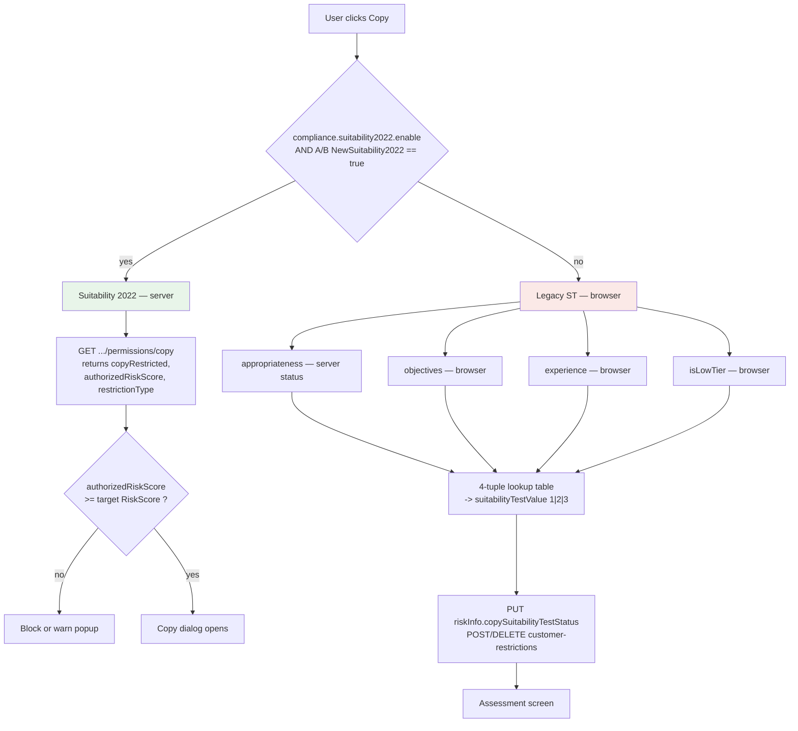

# Suitability Test — technical reference

Implementation behaviour, formulas and contracts. Companion to [product.md](product.md). Intended as input to `speckit.plan`.

Source tags: `[code]` = this repository at `ffdd803a37` or a named compliance service repo, `[service]` = the KYCAnalyzer service repository, `[prod-config]` = the live `ClientRiskProfileConfiguration` documents read from the prod `prod-kycanalyzer` Cosmos account on 2026-08-09 and mirrored under [config-prod/](config-prod/), `[static-data]` = the UI question catalogue and per-flow option filters in `compliance-kycx-staticdata`, `[confluence]`, `[inferred]`.

`[prod-config]` is the highest-authority source here: it is what the engine actually loads at runtime. Where it disagrees with Confluence, it wins. No client data was read — only the configuration container, which contains no personal data.

---

## 1. Architecture overview

Two implementations coexist. Which one runs is decided by a single A/B flag.



| Layer | Legacy ST | Suitability 2022 |
|---|---|---|
| Scoring | Browser, `kyc/src/app/suitability-tests.ts` `[code]` | KycAnalyzer service, config in Cosmos `[confluence]` |
| Config | Hardcoded question/answer IDs and constants | `ClientRiskProfileConfiguration` document per regulation + version |
| Persistence | `riskInfo.copySuitabilityTestStatus` + `customer-restrictions` | `ClientRiskProfile` Cosmos document |
| Client role | Compute, decide, persist, render | Read a decision, compare one number, render |
| Enforcement point | KYC wizard during the copy funnel | `ComplianceSuitabilityService.allowedToCopy` at copy intent |

The legacy path is still compiled and shipped. It is reachable wherever the flag is off. Treat it as live-but-deprecated, not dead.

---

## 2. Suitability 2022 — the three gates

`Copy Rules` `[confluence]` lists the gates in evaluation order. All are evaluated server-side and surfaced through one endpoint.

| Gate | Config key | Result field | Effect |
|---|---|---|---|
| **G1 Suitability block** | `Suitability.SuitabilityBlock` | `copyRestricted: true`, reason `100 CopyBlocked` | Total block from all copy |
| **G2 Risk-score cap** | `Suitability.RiskLevel` + `RiskLevelToScoreMappings` | `authorizedRiskScore: n`, reason `101 RiskScoreRestricted` | May copy only targets with risk score ≤ n |
| **G3 Ongoing monitoring** | `OngoingMonitoring` | reason `102 CopyBlockedByFsust` | Blocks **new** copies only; existing copies untouched |

```csharp
public enum RestrictionReason { CopyBlocked = 100, RiskScoreRestricted = 101, CopyBlockedByFsust = 102 }
```
`[confluence]` `API Example`, `HLD COAKV-4180`

Note `CopyBlockedByOngoingMonitoring = 102` also exists client-side in `etoro/libs/compliance/src/lib/trading/bl/compliance-crypto-promotion.model.ts:4`, but **nothing branches on it** `[code]`. Reason 102 therefore collapses into the generic block popup.

---

## 3. G1 — SuitabilityBlock (hard block)

Verbatim from the live production Cosmos document `CySEC-24`, read directly from the `ClientRiskProfileConfiguration` container `[prod-config]` and mirrored in [config-prod/CySEC-24.json](config-prod/CySEC-24.json):

```json
"SuitabilityBlock": {
  "Checks": [{
    "Condition": "All", "Priority": 1, "Result": "Blocked",
    "DefaultResult": "NotBlocked", "MinCount": 1, "IsAlternative": false,
    "QuestionAnswerChecks": [
      {"Condition":"Any","Question":"RiskAppetite","Answers":["Plus5ToMinus3Percent"]},
      {"Condition":"Any","Question":"TradingPurpose","Answers":["FuturePlanning","SavingsForHome"]},
      {"Condition":"Any","Question":"AnnualIncome","Answers":["UpTo10K","Between10KAnd50K","Between50KAnd200K"]},
      {"Condition":"Any","Question":"LiquidAssets","Answers":["UpTo10K","Between10KAnd50K","Between50KAnd200K"]}
    ]
  }]
}
```

Read as a predicate:

```
BLOCK from all copy  IF
      RiskAppetite  = 5% / -3%                            (the single lowest band)
  AND TradingPurpose IN { Future planning, Saving for home }
  AND AnnualIncome   <  200K
  AND LiquidAssets   <  200K
```

The outer `Condition: "All"` is what makes this rare — the description on `CopyTrading new suitability test` `[confluence]` is *"a very small number of users that have relatively poor financial status as well as very low risk tolerance"*.

**This rule is not the same in every regulation.** Reading all five live documents `[prod-config]`:

| Regulation | RiskAppetite trigger | TradingPurpose trigger | Extra condition | Check `DefaultResult` |
|---|---|---|---|---|
| CySEC v24 | `Plus5ToMinus3Percent` | `FuturePlanning`, `SavingsForHome` | — | `NotBlocked` |
| FCA v15 | `Plus5ToMinus3Percent` | `FuturePlanning`, `SavingsForHome` | — | `Blocked` — *inert, see below* |
| ASIC v9 | `Plus5ToMinus3Percent` | `FuturePlanning`, `SavingsForHome` | — | *absent* |
| FSRA v10 | `Plus5ToMinus3Percent` | `FuturePlanning`, `SavingsForHome` | — | *absent* |
| ASIC GAML v15 | `Plus5ToMinus3Percent`, **`Plus10ToMinus6Percent`** | **`FuturePlanning` only** | **`IncomeSource = Pension`** | `NotBlocked` |

**Only one regulation actually differs. ASIC GAML is materially stricter**: it catches the second-lowest risk-appetite band as well as the lowest, and adds a fifth condition on income source — a pensioner saving for retirement on a modest income is blocked there and not under CySEC. ASIC and FSRA are older-schema documents that omit `DefaultResult`, `MinCount`, `IsAlternative` and the per-question `IsRequiredForCopy` flags entirely, so the engine's own defaults apply. Their block is otherwise the CySEC block.

### 3.2.1 FCA's `Blocked` default never runs

The `DefaultResult: "Blocked"` on FCA-15's check reads like a fail-closed rule — where CySEC lets an unevaluable check pass, FCA would fail it shut. **It is dead configuration.** FCA's hard block behaves exactly like CySEC's. Three facts from the call path `[code]` settle it:

1. `SuitabilityCalculator` calls `BlockCalculator.Calculate(gcid, Block, answers)`. That method passes the ***block***-level `DefaultResult` into every check and returns it when no check applies. The block-level value is `NotBlocked` in all five configs — including FCA.
2. `Check.DefaultResult` is read in exactly one place in the codebase: the nested-check branch of `CheckCalculator.ApplyWithResult` (`isNestedAnswered ? isAppliedResult : nestedCheck.DefaultResult`). That method is only reached from `CalculateWithBlockResult`, the Negative Market path. Suitability never calls it, and the suitability block has `"NestedChecks": []` anyway.
3. Separately, there is no fail-closed behaviour to invert. `QuestionAnswersCalculator.TryApply` returns `false` for an unanswered question **regardless of `IsRequired`** — the flag only affects the `isAnswered` out-parameter, which `Calculate` discards. With `Condition: "All"`, one unanswered question makes the check inapplicable and the user falls through to `NotBlocked`.

So an incomplete profile is never hard-blocked, under any of the five. Note this is the *within-a-single-run* behaviour; it does not contradict the retention rule below, which governs whether a run happens at all.

**Missing answers do not clear a previous block.** *"If not enough questions answered to calculate suitability block, we should not recalculate previous result"* `[confluence]` `HLD COAKV-3587`. The prior result is retained rather than defaulted.

---

## 4. G2 — ClientRiskLevel and the per-answer scoring tables

### 4.1 Aggregation

```json
"RiskLevel": {
  "Operation": "Min",
  "DefaultRiskLevel": "Medium",
  "Factors": [
    { "Name": "A", "Operation": "Min", "RevolvingDoorOrder": 2, "Components": ["5","6"] },
    { "Name": "B", "Operation": "Avg", "Round": "Down", "RevolvingDoorOrder": 1,
      "Components": ["1","2","3","4","7","8"] }
  ]
}
```
`[confluence]`

```
Factor A        = MIN(C5, C6)
Factor B        = AVG(C1, C2, C3, C4, C7, C8 [, C9])   rounded DOWN
ClientRiskLevel = MIN(Factor A, Factor B)
```

**Component 9 is CySEC-only.** The shape above is confirmed identical across every regulation whose configuration ships in the service's test assets — CySEC 1→24, FCA 13→15, FSRA 9→10, ASIC 8→9, ASIC GAML 13→15 all use `Min` at the top, `Min` over `{5,6}` for Factor A and `Avg`/`Round: Down` over `{1,2,3,4,7,8}` for Factor B `[code]`. From **CySEC-20** onwards the CySEC document adds a seventh component `9`, the MiCA crypto-knowledge block, to Factor B; no other regulation has it. Averaging over seven terms instead of six meaningfully changes outcomes — a user who maxes every other component but fails the MiCA questions drops from `High` to `MediumHigh`, i.e. from an authorised risk score of 10 to 8.

`Round: Down` truncates. The `Avg` implementation without `Round: Down` rounds **up** instead — `Truncate(avg − 0.0001) + 1` `[code]` — so the direction is a per-factor config decision, not a global convention. Both production factors that average specify `Down`.

Level ordinals, used for both the MIN and the AVG `[confluence]`:

| RiskLevel | Weight |
|---|---|
| Minimal | 0 |
| Low | 1 |
| Medium | 2 |
| MediumHigh | 3 |
| High | 4 |

Each **component** whose definition lists several questions applies `Operation: "Max"` across them, so the most experienced product wins.

`DefaultRiskLevel` is **`Medium`** in production. The original design document proposed `Low` — *"For now default value should be Low"* `[confluence]` `HLD COAKV-3587` — so any analysis quoting `Low` predates the shipped config.

**All four aggregation rules are confirmed against stored production outcomes — 231,537 scored profiles, all five regulations, zero exceptions** `[prod-data]`. Competing readings were scored in the same pass and falsified: for Factor B, round-to-nearest matched 25% and `Min` 34%; for the multi-question components, floor-average and `Min` each matched 48%. Method in [prod-validation.md](prod-validation.md).

The root `Min` is the single most consequential line here, so it is worth stating in plain terms: **a user's risk level is capped by their weaker factor, and strength in one half never compensates for weakness in the other.** In the production snapshot, 17,020 users with Factor A `Low` and Factor B `Medium` came out `Low`; 238 with Factor A `Medium` and Factor B `High` came out `Medium`.

### 4.2 Component → question map

| C | Component | Config question name(s) | Legacy KYC question ID `[inferred]` | Factor |
|---|---|---|---|---|
| 1 | Experience — frequency | `Equities`, `Crypto`, `LeveragedCfd` | 33, 34, 35 | B |
| 2 | Experience — volume | `EquitiesInvestedAmount`, `CryptoInvestedAmount`, `LeveragedCfdInvestedAmount` | 47, 48, 45 | B |
| 3 | Trading knowledge | `TradingKnowledge` | 3 | B |
| 4 | Trading strategy / holding duration | `TradingStrategy` | 5 | B |
| 5 | Purpose of trading | `TradingPurpose` | 8 | **A** |
| 6 | Risk appetite | `RiskAppetite` | 9 | **A** |
| 7 | Source of income | `IncomeSource` | 15 | B |
| 8 | Complex-products knowledge assessment | `TradingKnowledgeAssessment` | 23 | B |
| 9 | MiCA crypto knowledge *(CySEC ≥ 20 only)* | `MiCACryptoAssessmentHighVolatility`, `…CyberRisks`, `…RecoverLoss`, `…InvestingRisks`, `…PrivateKey` | — | B |
| — | *(G1 only)* | `AnnualIncome`, `LiquidAssets` | 10, 11 | — |

Component 9 is the only component that does not use `Max`: it specifies `Operation: "Avg"`, `Round: "Down"` and `DefaultRiskLevel: "Low"`, so an unanswered MiCA question contributes `Low` rather than the global `Medium` default. Each of its five questions is single-select with exactly one informed answer scoring `High` and two wrong answers scoring `Low`; all five are `IsRequiredForCopy: true`.

**The question-ID column is confirmed**, not inferred. Every value matches the `KycQuestion` enum in the KycAnalyzer contract package, `eToro.KYCAnalyzerService.Enums/ClientRiskProfile/KycQuestion.cs:5-46` `[code]`, which is the authoritative symbolic-name → numeric-ID mapping the service itself compiles against. This closes the Component 7 doubt too: `IncomeSource = 15` and `WhatAreYourSourcesOfFunds = 26` are separate enum members, so C7 is unambiguously Q15.

### 4.3 Answer → RiskLevel, every question

All tables verbatim from the live production documents `[prod-config]`. They are identical across CySEC-24, FCA-15, ASIC-9, ASIC GAML-15 and FSRA-10 **with one exception — `TradingPurpose`, below.** An earlier reading of a 2024 Confluence dump described the tables as identical between regulations; that was true of the two documents on that page and is not true in general. **Every answer ID below is confirmed** against the `KycAnswer` enum in the KycAnalyzer contract package, `eToro.KYCAnalyzerService.Enums/ClientRiskProfile/KycAnswer.cs` `[code]`.

**C5 — TradingPurpose** (Factor A)

| Answer | ID | RiskLevel | Weight | Regulations |
|---|---|---|---|---|
| ShortTermReturns | 19 | High | 4 | scored by all |
| AdditionalRevenues | 20 | MediumHigh | 3 | scored by all |
| FuturePlanning | 21 | Medium | 2 | scored by all |
| SavingsForHome | 22 | Medium | 2 | scored by all |
| PurposeInvestments | 900 | Low | 1 | **scored by CySEC only** |
| PurposeTrading | 901 | Medium | 2 | **scored by CySEC only** |
| PurposeCryptoToFiat | 902 | High | 4 | **scored by CySEC only** |
| PurposeCryptoTradingAndOrConversion | 903 | — | — | **scored by none** |

Ids from `KycAnswer` `[code]`; the scored sets from prod `[prod-config]`.

This is the one answer table that is genuinely regulation-specific. `PurposeInvestments` matters most — it is the sole `Low` answer to a Factor A question, and Factor A is a `Min`, so under CySEC it single-handedly caps a user at `AuthorizedRiskScore` 3 no matter how experienced they are.

**The funnel offers all eight answers regardless of regulation**, so "scored by CySEC only" does not mean "selectable under CySEC only" — the other regulations let a user pick 900, 902 or 903 and then score them by fallback. §6.3 has the full cross-tab and the consequences.

**C6 — RiskAppetite** (Factor A)

| Answer | ID | RiskLevel | Weight |
|---|---|---|---|
| Plus5ToMinus3Percent | 23 | Low | 1 |
| Plus10ToMinus6Percent | 24 | Medium | 2 |
| Plus20ToMinus12Percent | 25 | MediumHigh | 3 |
| Plus40ToMinus24Percent | 26 | High | 4 |
| Plus80ToMinus48Percent | 27 | High | 4 |

Because Factor A is `MIN(C5, C6)` and C5 never drops below `Medium`, **risk appetite alone sets the ceiling** for any user who selects the lowest band: choosing 5%/−3% caps the whole profile at `Low`, and therefore at `AuthorizedRiskScore 3`, regardless of every other answer. This is the highest-leverage single answer in the questionnaire.

**C1 — Experience frequency** (MAX of the three)

| Answer | ID | Equities | Crypto | LeveragedCfd |
|---|---|---|---|---|
| NeverTraded | 49 | Medium | Medium | Medium |
| ZeroTo10 | 122 | Medium | MediumHigh | MediumHigh |
| TenTo20 | 123 | MediumHigh | High | High |
| Above20 | 124 | High | High | High |
| TenTo40 | 210 | — | — | High |
| Above40 | 211 | — | — | High |

**C2 — Experience volume** (MAX of the three)

| Answer | ID | Equities | Crypto | LeveragedCfd |
|---|---|---|---|---|
| OneTo500 | 138 | Medium | Medium | MediumHigh |
| From500To2000 | 139 | Medium | High | High |
| Above2000 | 140 | Medium | High | High |
| NeverVolume | 147 | Medium | Medium | Medium |

Equities volume is flat at `Medium` for every band — the amount invested in stocks never moves the score. Only crypto and leveraged CFD volume do.

**C3 — TradingKnowledge**

| Answer | ID | RiskLevel |
|---|---|---|
| ProfessionalCertificate | 51 | High |
| AcademicDegree | 52 | High |
| TradingCourses | 53 | MediumHigh |
| NoFinancialKnowledge | 54 | Medium |

**C4 — TradingStrategy**

| Answer | ID | RiskLevel |
|---|---|---|
| FewSecondsUpTo24 | 12 | High |
| FewWeeksUpToSeveralMonth | 13 | MediumHigh |
| MoreThenSeveralMonths | 14 | Medium |

**C7 — IncomeSource**

| Answer | ID | RiskLevel |
|---|---|---|
| Salary | 63 | High |
| Employed | — | High |
| Investments | 64 | High |
| Savings | 47 | High |
| BusinessActivities | — | High |
| CryptoRelatedGains | — | High |
| Inheritance | 45 | **MediumHigh** |
| FamilyFinancialSupport | 90 | Medium |
| Other | 105 | Medium |
| Pension | 65 | Low |
| SocialSecurity | 89 | Low |
| Severance | 91 | Low |

Corrected against `ClientRiskProfileConfiguration_CySEC_24.json` `[code]`. The earlier Confluence-derived table had `Inheritance` at `High` and omitted `Employed`, `BusinessActivities` and `CryptoRelatedGains` entirely. C7 is a Factor B term, so an `Inheritance` answer that was being read as `4` is really `3`.

**C8 — TradingKnowledgeAssessment**

Scored rather than mapped directly. The configuration scores a **six-statement true/false quiz presented as one multi-select** — two of the statements are factually true, four are false, and the sign of the weight tracks the truth of the statement exactly. Only **five of the six are still asked**; see §4.3.1 before using the arithmetic below.

| Answer | ID | Key | Statement | True? | Score |
|---|---|---|---|---|---|
| `NewerLeverage` | 142 | `Q1C` | "I deposit and invest $1,000 to open a position with $20,000 (using leverage of 20x). If the market moves 5% against my position, I'll lose my investment" | **yes** | +2 |
| `NewerMarginCall` | 144 | `Q3C` | "If the total equity … in my account falls below the required margin, a 'margin call' will liquidate my positions" | **yes** | +2 |
| `NewerCfd` | 143 | `Q2C` | "If the price of Google's stock rises on NASDAQ, the price of my Google contract for difference (CFD) will go down" | no | −2 |
| `NewerStopLossTrigger` | 145 | `Q4C` | "My open positions will remain open even when a stop loss is triggered" | no | −2 |
| `NewerStopLossGapThrough` | 146 | `Q5C` | "If the market gaps through my stop loss, my position will close at the exact stop loss level" | no | −2 |
| `NewerCfdTrs` | 212 | — | "I will be able to sell my OTC complex products (CFD, TRS) outside of eToro platform" — **retired, still scored but no longer asked (§4.3.1)** | no | −2 |

Statement text and `tradingAssessment.Q1C`–`Q6C` keys from `kyc/src/app/__mocks__/kyc-aggregated.mock.ts:10478-10548` `[code]`; IDs and correctness from `KycAnswer.cs:155-174` `[code]`, where the analyzer enum groups these six under `// Question 23 - complex product knowledge assessment` and annotates **exactly** `NewerLeverage = 142` and `NewerMarginCall = 144` with `// correct answer`. That is the same two answers the config gives `+2`, so the sign of the weight provably encodes the truth of the statement. Two superseded phrasings of the same quiz are still in the enum: IDs 84–87 and 101–104 + 127, each with a single correct answer.

Total → RiskLevel:

| Total score | RiskLevel |
|---|---|
| ≥ 6 | High |
| ≥ 2 | MediumHigh |
| ≥ −6 | Medium |
| ≥ −100 | Low |

**The config never states how a statement the user did not tick is treated. The service does, and it credits every judgement.** `WeightQuestionAnswerCalculator.GetScoreByAnswerIds` walks the whole answer group, not the user's selections `[code]`:

```csharp
foreach (var item in weightAnswerConfiguration.Answers)
{
    if (questionAnswer.AnswerIds.Contains((int)item.Answer))
        score += item.Score;
    else
        score -= item.Score;
}
```

An unticked answer subtracts its weight. Because a false statement carries `−2`, leaving it alone adds `+2`; because a true statement carries `+2`, leaving it alone costs `−2`. **No statement can contribute zero.** With `k` of the 6 configured statements judged correctly the total is `4k − 12`:

| Correct | Total | Band | Reachable in production? |
|---|---|---|---|
| 6 | +12 | High | yes |
| 5 | +8 | High | yes |
| 4 | +4 | MediumHigh | yes |
| 3 | 0 | Medium | yes |
| 2 | −4 | Medium | yes |
| 1 | −8 | Low | yes |
| 0 | −12 | Low | **no** — see §4.3.1 |

All four bands are reachable and both the `≥ 6` threshold and the `−100` floor do real work. The CFD Negative Market cutoff below (`≥ −3`) reads as "at least 3 of 6 correct".

This is confirmed twice over: by the source above, and by the calculator's own parameterised test, `WeightQuestionAnswerCalculatorTests.AnswerTestData` `[code]`, which asserts a `RiskLevel` for 14 different selections against the real CySEC configuration. All of them reproduce exactly under `4k − 12` — for example ticking `NewerLeverage` alone is 5 of 6 correct, `+8`, `High`; ticking `NewerCfd`, `NewerStopLossTrigger` and `NewerStopLossGapThrough` is 1 of 6 correct, `−8`, `Low`. Those vectors exercise the configured group, so they include selections no live user can produce.

#### 4.3.1 One of the six statements is scored but no longer asked

The configuration scores **six** statements. The live question catalogue offers **five** — `142, 143, 144, 145, 146` `[static-data]` `Questions/OptionQuestions.json`. Statement **212 is absent**, and so is any `Q6C` / `A06` translation key; the only `212` values anywhere in that repo are country codes. The six-statement list above comes from `kyc-aggregated.mock.ts`, a legacy client mock, which is why it still shows a statement production retired.

Because `GetScoreByAnswerIds` iterates the *configured* group, a statement that cannot be ticked always takes the `else` branch. Statement 212 carries `−2`, so it contributes `−(−2) = +2` to **every** user's score, unconditionally. The consequences:

- **Every score is inflated by a constant `+2`.** The reachable totals are `−8, −4, 0, +4, +8, +12`, not `−12 … +12`. The `−12` row above is dead.
- **`High` needs 4 of the 5 answerable statements, not 5 of 6.** `Low` now requires getting *all five* wrong, where the table implies two ways to reach it.
- **No outcome actually changes.** Enumerating all 32 selections a real user can make, and comparing the live six-statement config against a hypothetical five-statement one, every suitability band and every CFD Negative Market block result is identical. Both mappings space their thresholds 4 apart and the offset is 2, so it never crosses a boundary.

So this is a data-hygiene defect, not a scoring defect — worth fixing, but nobody's risk level is wrong because of it. What *is* wrong is the band table as a description of reality: anyone reasoning from `4k − 12` over six statements will predict a range no user can produce and a `Low` band twice as wide as it is. The same stale statement sits in the `CfdNegativeMarket`, `MarginNegativeMarket` and `FuturesNegativeMarket` rule groups too, with the same null effect.

Removing 212 from the configs would be safe on today's thresholds, but it is not a no-op to reason about: it shifts every raw score down by 2, and `−6` and `+2` are exactly on band boundaries. Re-run the enumeration before changing either the group or the thresholds.

**The one case that does not score at all is ticking nothing.** `CalculateWeightAnswerGroupRiskLevel` bails out with `null` when none of the group's answers appear in the user's selection `[code]`, so the weight path produces an empty array and `CalculateQuestionResult` falls back to `DefaultRiskLevel`. C8 has no component-level default, so that is the global `Medium`. This is a reachable state: Q23 is `IsRequiredForCopy: false`, so a user can skip it and still copy. It is also why the arithmetic above never has to answer "what does a user who engages with nothing score" — such a user is not scored, they are defaulted.

There is a third path. If the user's selection contains only *legacy* answer IDs (`Leverage`, `Cfd`, `NewStopLoss` and so on) that are not members of the weight group, the group again returns nothing and `GetQuestionAnswerRiskLevels` falls through to the plain `Answers` mapping below, combined with the component's `Max`.

That legacy direct-mapping answer set is `Leverage`, `MarginCall`, `StopLoss`, `NewMarginCall`, `NewCfd`, `NewStopLoss`, `NewStopLossGapThrough` → `Medium`, with `Cfd` and `NewLeverage` at `High` `[code]`.

A separate scoring path exists for the case where **every** answer in the group carries an `IsCorrect` value: `GetScoreByAnswerVerity` matches the user's per-answer Yes/No free text against the configured truth value and only ever *adds* score `[code]`. That path is used by the Crypto Negative Market knockout, whose config supplies `{Score: 1, IsCorrect: true, AnswerValue: "Yes"}` pairs and a `MinTotalScore: 5` cutoff. **Suitability never takes it** — no C8 answer sets `IsCorrect`. Do not conflate the two when reading the calculator.

**The same score, two different thresholds.** The identical answer→score table is consumed by the CFD Negative Market knockout with a pass/fail cutoff instead of bands:

```json
[{"BlockResult":"Blocked","MinTotalScore":-100},{"BlockResult":"NotBlocked","MinTotalScore":-3}]
```

So `≥ −3` means "not CFD-blocked", while suitability reads the same number through the four-band table above. Prior analysis that described "+2 correct, −2 wrong, fail below −3" as the *suitability* rule was describing the Negative Market rule.

### 4.4 Output banding

```json
"RiskLevelToScoreMappings": [
  {"RiskLevel":"Minimal","AuthorizedRiskScore":3},
  {"RiskLevel":"Low","AuthorizedRiskScore":3},
  {"RiskLevel":"Medium","AuthorizedRiskScore":6},
  {"RiskLevel":"MediumHigh","AuthorizedRiskScore":8},
  {"RiskLevel":"High","AuthorizedRiskScore":10}
]
```
`[confluence]`

`Minimal` and `Low` collapse to the same cap of 3. The field is a single scalar ceiling, not a range — the implicit floor of 1 comes from eToro's risk-score scale, not from this config.

The comparison itself: *"Parent user score should be less then or equals to the current user Authorized score"* `[confluence]` `Copy Rules`.

### 4.5 Two ways the whole calculation is bypassed

`SuitabilityCalculator.CalculateAsync` returns before scoring anything in two cases `[code]`:

- **Verification level below 2.** No `Suitability` object is produced at all, so there is no risk level and no block — not a `Minimal` result, an absent one. Reaching level 2 is itself a recalculation trigger (`ReachedVerificationLevel2 = 3`).
- **eToro staff.** When the user's country is `Country.eToro` and the CCM flag `FeatureFlagAlwaysAllowCopyForEtorians` is on, the result is hardcoded to `ClientRiskLevel = High`, `SuitabilityBlock = NotBlocked`, `IsAllQuestionsAnswered = true`, with the formulas skipped entirely. Ongoing monitoring is short-circuited to `ManuallyUnblocked = true` on the same condition. **Internal accounts are not a valid way to sanity-check this logic in a live environment.**

`IsAllQuestionsAnswered` — which the copy UI uses to decide whether to send the user back through the questionnaire — only counts questions flagged `IsRequiredForCopy: true`. In CySEC-24 that excludes all of Component 2 (the three invested-amount questions) and Component 8 (the knowledge assessment), while all five Component 9 MiCA questions are required.

### 4.6 Worked example

A user answering: risk appetite 20%/−12%; purpose additional revenues; never traded anything; no invested amounts; trading courses; holds a few weeks to several months; income from salary; knowledge assessment total 0.

```
C5 TradingPurpose  = AdditionalRevenues -> MediumHigh (3)
C6 RiskAppetite    = Plus20ToMinus12    -> MediumHigh (3)
Factor A = MIN(3, 3) = 3

C1 = MAX(NeverTraded x3)     -> Medium (2)
C2 = MAX(NeverVolume x3)     -> Medium (2)
C3 = TradingCourses          -> MediumHigh (3)
C4 = FewWeeksUpToSeveralMonth-> MediumHigh (3)
C7 = Salary                  -> High (4)
C8 = score 0 -> band ">= -6" -> Medium (2)
Factor B = AVG(2,2,3,3,4,2) = 16/6 = 2.67 -> round down -> 2 (Medium)

ClientRiskLevel = MIN(3, 2) = 2 = Medium
AuthorizedRiskScore = 6
```

Under CySEC the same user also carries C9. Failing all five MiCA questions gives `AVG(2,2,3,3,4,2,1) = 17/7 = 2.43 → 2`, unchanged here; answering them all correctly gives `AVG(…,4) = 20/7 = 2.86 → 2`, also unchanged. C9 only bites near a band edge — a user at `4` on every other Factor B component drops from `High` to `MediumHigh` on a failed MiCA quiz.

Factor B is where most users land, and it is dominated by the two experience components — a user who has never traded carries two `Medium` values into a six- or seven-term average, which is hard to overcome.

---

## 5. G3 — Ongoing monitoring

Verbatim `[confluence]` `Experience and Objectives questionnaire`, corroborated by `Copy Block - Ongoing Monitoring`:

```
FSUST = MIN(FSUSTcalculated, FSUSTdeclared)

FSUSTdeclared   = (average of current Q3 answer) x 50% x years since FTD, including the FTD year
FSUSTcalculated = (Q1 answer x 50%) + (Q2 answer x 50%)

CU = 50% x Cash Allocated (CA) - Realised P/L (RPL)

IF CU <= FSUST  THEN allow copy  ELSE block copy
```

| Symbol | Meaning | Source question |
|---|---|---|
| Q1 | Net annual income | Q10 |
| Q2 | Total net worth / liquid assets | Q11 |
| Q3 | Planned investment over the coming year | Q14 |
| CA | Initial investments into copies − cash removed + cash added | Portfolio |
| RPL | Realised P/L on **closed** copies — trade history filtered to rows with a mirror ID no longer active | Portfolio |

Worked example from the source: Q3 = 50K–100K, FTD 2021, now 2023 → `FSUSTdeclared = 75K × 50% × 3 = 112.5K`. Q1 = 30K, Q2 = 40K → `FSUSTcalculated = 15K + 20K = 35K`. `FSUST = 35K`.

`FinancialSustabilityCalculator` matches this exactly `[code]`, with three refinements the Confluence page leaves out:

- The three `50%` weightings are **not hardcoded**. They are `ExpectedFundsToAllocateToCopyTrading`, `IncomeSuitabilityWeighting` and `CashAndLiquidAssetsSuitabilityWeighting`, read per request from CCM key `FSUSTFormulaFactors`. All three are `0.5` in the service's own fixtures, but they can be retuned without a deploy.
- "Years since FTD" is `(DateTime.Now.Year − ftdDate.Year) + 1` — whole calendar years plus one, so a user who first deposited in December 2025 is already on `2` in January 2026.
- The band-to-amount conversion is CCM key `FSUSTAnswerToExactMoneyAmountMapping`, an explicit `KycAnswer → int` dictionary rather than a computed midpoint: `UpTo10K → 5,000`, `Between10KAnd50K → 30,000`, `Between50KAnd200K → 125,000`, `Between200KAnd500K → 350,000`, `Between500KAnd1M → 750,000`. These match the midpoints the workbook took from the client's `answers.data.ts`, which resolves that caveat.

The whole calculation returns `null` — not a block — when FTD is missing, verification level is below 2, any of the three answers is absent, or a band is missing from the mapping. `BlockedByOngoingMonitoring` is `CU > FSUST`, overridden to `false` by a manual unblock, and `null` when either input is `null` `[code]`.

**Confirmed on production, once.** A live CySEC v24 profile storing `FinancialSustainability: 190000` recomputes to exactly that from its own answers — income `$10K–$50K` and liquid assets `$200K–$500K` at 50% each give 190,000, against 375,000 on the declared path, and `Min` takes the balance sheet (C-60). A second live profile with no `FtdDate` stores neither figure despite answering all three money questions, which is the `null` path above rather than a fallback to the balance sheet alone (C-61). That is one profile touching four of the sixteen band entries, so the formula, the `Min` and the year count are now production-verified while most of the band table is not (G-13). Two entries are actively uncertain: the fixture prices `Between1MAnd5M` at `300,000`, below the band beneath it, where the client table says `3,000,000`; and `UpTo20K`, the lowest deposit band the funnel currently offers, has no entry at all (C-62). `explainer/src/domain/ccm.ts` carries the transcription and is the first place to check when a reconstruction disagrees.

Mechanics: evaluated **once a day**, so an answer change or a copy change takes effect the next day. Existing copies are never closed. Users get in-app and push notifications. Back Office shows `Ongoing monitoring` or `Blocked` under More Info → Restrictions.

Persisted state `[confluence]` `Suitability data reports`:

```json
"OngoingMonitoring": {
  "FtdDate": "...", "FinancialSustainability": 5000,
  "CopyUtilization": null, "BlockedByOngoingMonitoring": null
}
```

**There is no client surface for this at all.** Searches for `FSUST`, `copyUtilisation`, `ongoingMonitoring` and `sustainability` across `etoro/` return nothing `[code]`. The user only ever sees the generic block popup.

---

## 6. Recalculation and versioning

```csharp
public enum RecalculationReason {
    BulkRecalculation = 1, RegulationChanged = 2, ReachedVerificationLevel2 = 3,
    AnswerChanged = 4, Manual = 5, CountryChanged = 12
}
```
`[confluence]`

In prose: *"There has been a change in one or more of the relevant KYC questions in the 'Experience & Objectives' questionnaire. The client has changed regulations. Internal changes to suitability formula logic."* `[confluence]`

Each recalculation writes a `ClientRiskProfileLog` entry, retained **1 month** `[confluence]`.

Configuration is versioned per regulation as a Cosmos document id — `FCA-15`, `CySEC-24`. `CurrentClientRiskProfileConfigurationVersion` in CCM is the pointer that selects the active version, described as *"the master switch"* `[confluence]`. Formula changes are therefore a config deploy, not a code deploy.

### 6.1 What is actually in production

The `ClientRiskProfileConfiguration` container in the prod `prod-kycanalyzer` Cosmos account holds **104 documents across 14 regulations** `[prod-config]`. Highest version per regulation:

| Regulation | Versions present | Latest | Runs a suitability test? |
|---|---|---|---|
| CySEC | 1–24 | **24** | yes, the only one with Component 9 |
| FCA | 1–15 | **15** | yes |
| ASICGAML | 1–15 | **15** | yes, with the stricter hard block |
| MAS | 2–12 (plus v1 as `13-1`) | 12 | **no longer** — v1 and v2 scored, v3+ do not |
| FSRA | 1–10 | **10** | yes |
| ASIC | 1–9 | **9** | yes |
| Offshore | 1–7 | 7 | **no** |
| FINRA | 1–6 | 6 | **no** |
| FINRAONLY | 1–2 | 2 | **no** |
| `13-1` | 1 | — | orphaned MAS v1, see below |
| FinCEN, NFA, NYDFSFINRA, eToroUS | 1 | 1 | **no** |

**Only five regulations run a suitability test at their current version:** CySEC, FCA, ASIC, ASIC GAML and FSRA. The rest ship documents whose `Suitability` block carries no `RiskLevel.Factors`, and gate copy trading through other mechanisms.

#### The `13-1` document is MAS version 1

`Regulation.MAS = 13` `[code]` `kycanalyzer-nuget/eToro.KYCAnalyzerService.Enums/Regulation.cs`, and the document id is computed as `$"{Regulation}-{Version}"` `[code]` `ClientRiskProfileConfiguration.cs`. When the v1 MAS document was written the serializer's enum had no member for 13, so `ToString()` produced the bare number and the id became `13-1` instead of `MAS-1`. Two facts confirm this rather than leaving it a guess: **`MAS-1` does not exist** in the container — MAS versions run 2 to 12 — and `13-1` is structurally an older-schema copy of the same template `MAS-2` uses.

Two consequences worth knowing:

- **`13-1` is unreachable through the normal read path.** `GetConfigurationAsync` constructs a throwaway configuration object purely to compute `.Id` and then point-reads it `[code]` `ClientRiskProfileConfigurationRepository.cs:21-30`, so asking for MAS v1 looks up `MAS-1` and misses. `GetAllConfigurationAsync` instead fetches every document and filters **client-side on the deserialized enum** (`allConfigs.Where(c => c.Regulation == …)`, line 38-42), and Newtonsoft's `StringEnumConverter` accepts the bare `13` — so an administrative listing shows MAS with a version 1 that cannot be fetched individually. Harmless today because v1 is not current, but it is a real inconsistency between the two read paths.
- **MAS did once run the suitability test and no longer does.** `13-1` and `MAS-2` both carry the full factor tree; from `MAS-3` onward the `Suitability` block is present but empty, and it stays empty through the current `MAS-12`. MAS is the only regulation in the container that had suitability and had it removed.

### 6.2 Per-regulation divergence

Comparing all five suitability-bearing documents against `CySEC-24` `[prod-config]`:

- **Factor structure is universal.** `Factor A = Min(C5, C6)`, `Factor B = Avg(C1, C2, C3, C4, C7, C8) rounded down`, `ClientRiskLevel = Min(A, B)`, `DefaultRiskLevel = Medium`. Identical in every one.
- **`RiskLevelToScoreMappings` and `RiskLevelWeight` are identical everywhere** — `Minimal/Low → 3`, `Medium → 6`, `MediumHigh → 8`, `High → 10`, and weights `0/1/2/3/4`.
- **Component 9 is CySEC-only.** Factor B has seven components under CySEC and six under all the others.
- **`TradingPurpose` is scored for seven answers under CySEC and four elsewhere**, while the funnel offers eight to everyone (see §6.3 — this is the most consequential divergence found).
- **`IncomeSource` is identical across the five** at twelve answers; only `13-1`, the orphaned MAS v1, differs.
- **The hard block differs under ASIC GAML and FCA** (see §3).
- **The same answer can appear under two different names.** In Component 8, CySEC-24 writes `NewerCfd` where FCA-15 writes `IfThePriceOfGoogleStockOnNasdaqGoesUpThePriceOfYourCfdInGoogleWillGoDownNew`. These are **aliases of the same enum value, 143** `[code]` `KycAnswer.cs:168-169`, the long form marked obsolete, so the engine treats them identically. Compare resolved numeric ids, never the strings, or you will read one answer as two.

They also diverge on the *adjacent* CFD Negative Market auto-release: FCA `{DaysFromFtd: 30, AmountOfClosedTradingPosition: 5}` versus CySEC `{60, 20}` `[confluence]`.

Phase-1 rollout scope `[confluence]` `HLD: COAKVB-4860`: `DesignatedRegulation` 1 (CySEC), 2 (FCA), 4 (ASIC), 10 (ASIC GAML), 11 (FSRA), plus country 219 (US) — consistent with the five suitability-bearing documents found in prod.

### 6.3 The funnel offers answers the scoring config does not score

The question catalogue that drives the UI and the scoring configuration in Cosmos are **separate artifacts maintained by different repos**, and for question 8 they disagree.

The copy funnel offers **all eight** `TradingPurpose` answers to every user `[static-data]` `Filters/copy-flow.json`, narrowing to six only for users in ASIC investment-risk-replace countries:

| Id | Answer | Offered in `copy-flow` |
|---|---|---|
| 19 | Short term | always |
| 20 | Additional revenue | always |
| 21 | Future planning | always |
| 22 | Saving for a home | always |
| 900 | Investments | except ASIC replace |
| 901 | Trading | except ASIC replace |
| 902 | Crypto to fiat | always |
| 903 | Crypto trading and/or conversion | always |

The scoring configs list far fewer. When a user's answer id is absent from the config, `GetQuestionAnswerRiskLevel` returns `defaultRiskLevel` `[code]` `SuitabilityRiskLevelCalculator.cs:43-51` — which for Component 5 is the config-wide `DefaultRiskLevel`, **Medium**. No error, no log, no rejected answer.

| Answer | CySEC-24 | FCA-15 | ASIC-9 | ASICGAML-15 | FSRA-10 |
|---|---|---|---|---|---|
| 19 Short term | High | High | High | High | High |
| 20 Additional revenue | MediumHigh | MediumHigh | MediumHigh | MediumHigh | MediumHigh |
| 21 Future planning | Medium | Medium | Medium | Medium | Medium |
| 22 Saving for a home | Medium | Medium | Medium | Medium | Medium |
| 900 Investments | **Low** | *Medium* | n/a | n/a | *Medium* |
| 901 Trading | Medium | *Medium* | n/a | n/a | *Medium* |
| 902 Crypto to fiat | **High** | *Medium* | *Medium* | *Medium* | *Medium* |
| 903 Crypto trading / conversion | *Medium* | *Medium* | *Medium* | *Medium* | *Medium* |

*Italic* = not in the config, value arrived at by fallback rather than by design.

Three things follow:

1. **Answer 903 is scored by no live configuration**, CySEC included, yet is offered under every regulation. Every user who picks it gets Medium on Component 5.
2. **"Investments" is the one answer where the gap is materially more permissive.** CySEC deliberately scores it `Low`, the most conservative value on the question. Under FCA and FSRA the same answer falls back to `Medium`. Because `Factor A = Min(C5, C6)`, a user whose conservative signal was that answer ends with `AuthorizedRiskScore` **6 instead of 3** — twice the copy permission, from a configuration gap rather than a policy decision.
3. **"Crypto to fiat" cuts the other way**: `High` under CySEC, `Medium` by fallback everywhere else.

Both directions are pinned by test cases in `verify_workbook.py`, and the calculator models the fallback rather than assuming the CySEC value applies everywhere.

Before changing any Q8 scoring, check whether the intended fix is to extend the configs or to restrict the funnel — the two repos have to move together, and today neither one records the other's assumption.

**Question 8 is not the only place this happens.** On question 15, `InvestmentsDeposits = 46` has been selected by **28,850 users** and is scored by none of the five configs — each lists twelve `IncomeSource` answers and 46 is not among them `[prod-data]`. The same fallback applies and those users get `Medium` on Component 7. Answers 746–749 and 891 also appear on question 15 unscored, at roughly 1,600 users combined; they are absent from the `KycAnswer` enum entirely and look like another flow's ids leaking in.

The fallback itself is no longer only a code reading. Where an unscored answer occurs alongside scored ones, predicting "unscored contributes `DefaultRiskLevel`" matches the engine's stored component value and "ignore the unscored answer" matches none of them `[prod-data]`.

So the underlying defect is not a bad value on one question — it is that **nothing checks that every answer the funnel offers is scored by the config that will grade it.** Both known instances were found by inspection. A cheap CI assertion over the two artifacts would find the rest and prevent the next one.

### 6.4 Where a specific user's answers and result live

Everything above describes the formula. To reproduce a real user's score you need their answers, and those sit in four places with different fidelity. All are keyed by **GCID**, not CID.

| Store | Holds | Notes |
|---|---|---|
| `ClientRiskProfile` Cosmos container | The authoritative document: `QuestionsAnswers[]` plus the computed `Suitability` result tree | Same account as the configuration container. Partitioned by `/id`, and `id` is the GCID as a string, so a profile read is a point query |
| `GET /api/v1/kycanalyzer/clientRiskProfile/{gcid}` | **Not the same document.** The headline only — see below | `[code]` `ClientRiskProfileController`. `POST` to the same route forces a recalculation |
| `UserApiDB.KYC.CustomerAnswers` | SQL copy of raw answers: `GCID`, `QuestionId`, `AnswerId`, `OccurredAt`, `FreeText` | Primary key is all three of `GCID`, `QuestionId`, `AnswerId`, which is how multi-select questions such as Q23 store several rows. `AnswerId` is declared `MASKED WITH (FUNCTION = 'default()')` `[code]` `ComplianceDBs`, though the lake copy returns real ids |
| `KycAnalyzer.Analyzer.Suitability` | Relational projection of the result: `ClientRiskLevelID`, `SuitabilityBlockID`, `FinancialSustainability`, `CopyUtilization`, `ManuallyUnblocked`, `BlockedByOngoingMonitoring`, `IsAllQuestionsAnswered`, `RecalculationReasonID` | A **temporal table** with history in `History.Suitability`, so a user's risk level over time is queryable without an audit log `[code]` `ComplianceDBs` |
| `KycAnalyzer.Analyzer.SuitabilityCalculationDetail` | **The whole calculation tree, flattened into rows.** `SuitabilityID`, `ParentDetailID`, `Name`, `ClientRiskLevelID`, `QuestionID`, `RevolvingDoorOrder`, `SuitabilityCalculationDetailLevelID` | Also temporal, history in `History.SuitabilityCalculationDetail`. `ParentDetailID` is the self-join that rebuilds the hierarchy; the level column discriminates factor (1) / component (2) / question (3) `[code]` `ComplianceDBs` |

Two things to know before using these. The `AnswerId` masking means a query that appears to succeed can silently return meaningless answers, so verify against a known user before trusting a bulk extract. And the Cosmos document, not the SQL projection, is what the engine reads — treat SQL as a reporting mirror that can lag.

#### The REST API returns neither the tree nor the answers

The obvious route — ask the service for the profile — cannot answer "how was this score reached", because the two fields that would answer it are not in the contract:

| DTO | Declares | Does **not** declare |
|---|---|---|
| `ClientRiskProfileResultDto` | `Gcid`, `Regulation`, `CountryId`, `ConfigurationVersion`, `FtdDate`, the five `FirstTime*FlowOpen` timestamps, `RecalculationReason`, `Suitability`, `ProductAppropriateness`, `ProductNegativeMarkets` | **`QuestionsAnswers`**, **`LastAnswerOccurredAt`** |
| `SuitabilityResultDto` | `SuitabilityBlock`, `ClientRiskLevel`, `RevolvingDoorQuestions`, `OngoingMonitoring`, `IsAllQuestionsAnswered` | **`SuitabilityCalculationDetails`** |

`[code]` `kycanalyzer-nuget/eToro.KYCAnalyzerService.Dto/ClientRiskProfile/Result/`. Neither name appears on any DTO anywhere in that package.

This is worth stating plainly because it is easy to mistake for a serialisation problem and go looking for a fix. It is not one: the mapping profile declares `CreateMap<SuitabilityResult, SuitabilityResultDto>()` with no subtype includes `[code]` `Application/MappingProfiles/ClientRiskProfile.cs`, but even a perfect polymorphic mapping would have nowhere to put the tree. **Anything that needs the calculation path or the answers must read Cosmos or the SQL projection.** `RevolvingDoorQuestions` is the one piece of per-question information the API does expose — and it is only the weakest factor's questions (§4.7).

#### What the stored document actually looks like

Measured across 960 documents (578 with a suitability result), because several details differ from what the C# types suggest:

- **Enums serialise as names, not ids.** `Regulation: "CySEC"`, `ClientRiskLevel: "MediumHigh"`, `SuitabilityBlock: "NotBlocked"`, `RecalculationReason: "AnswerChanged"`. The exception is `QuestionsAnswers`, where `QuestionId` and `AnswerIds` are numeric. A reader that assumes one convention throughout will fail on half the document.
- **No node carries a level discriminator.** `SuitabilityCalculationDetailLevelID` exists on the SQL table but on **zero** of 7,231 Cosmos tree nodes. Depth is the only way to tell a factor from a component, and the tree is always exactly three levels — no node in the sample was deeper.
- **Question identity is the enum name.** `QuestionResult.Question` is a `KycQuestion` serialised by name, and where present it is always identical to `Name`. It is **absent on 289 of 7,231 leaves** (older configuration versions such as FCA-14), where `Name` alone carries it. Read `Question`, fall back to `Name`.
- **`RevolvingDoorOrder` appears on factor nodes only**, which matches `FactorResult`.
- **Absent sections, not empty ones.** A user the engine did not score has **no `Suitability` property at all** — not a null, not an object with nulls. Same for `ProductNegativeMarkets` entries: the MAS document carries only `Cfd` and `Etf` where an FCA one carries six products. Any reader must treat every section as optional.
- **There is no CID field.** The document has `Gcid` and `id` (the GCID as a string) and nothing else identifying. CID lookup needs an external identity source — see §6.5.

The detail table matters more than its obscurity suggests: it is the only store that holds the per-node calculation path in a form you can query without deserialising a polymorphic Cosmos document. `ClientRiskProfileSqlRepository.UpsertSuitabilityAsync` walks `SuitabilityCalculationDetails` and type-switches each node to set `RevolvingDoorOrder` (factors only), `QuestionID` (questions only) and the level id `[code]`. What it does **not** carry is `Regulation` or `ConfigurationVersion` — neither column exists on `Analyzer.Suitability` — so a tree read from SQL cannot be attributed to the config that produced it without joining back to Cosmos.

**The practical route is the data lake**, which needs no Cosmos data-plane access and is where the validation in [prod-validation.md](prod-validation.md) was run:

| Table | Contents | Freshness |
|---|---|---|
| `main.compliance.bronze_kycanalyzer_clientriskprofile` | The Cosmos document including the full `Suitability` tree — but **without** `QuestionsAnswers` | **Frozen snapshot, 2025-01-15 → 2025-01-23.** 344,675 documents, 231,537 scored |
| `main.compliance.bronze_userapidb_kyc_customeranswers` | Raw answers, `AnswerId` unmasked | Live |
| `main.compliance.bronze_userapidb_kyc_questions` | Question id → name and `MultipleSelection` | Live |

Because the profile mirror drops `QuestionsAnswers` and stops in January 2025 while the answers table is current-state, reconstructing a historical user means joining on `GCID` and restricting to users whose answers have not moved since — `max(OccurredAt) <= profile.UpdatedOn`. An answer that was *removed* leaves no trace in a current-state table, which is the one reconstruction error this method cannot detect.

### 6.5 Resolving CID → GCID, and why you must be told which is which

Everything in §6.4 is keyed by GCID. Turning a CID into one is a lookup, not a calculation — and getting it wrong is the highest-consequence mistake in this whole document, because it silently answers a question about one customer with another customer's compliance data.

#### The three spaces overlap almost completely

`UserApiDB.Customer.CustomerIdentification` assigns each human three numbers: `GCID` (primary key), `CID` (the legacy real-account id, indexed) and `DemoCID`. They are drawn from overlapping ranges, so a bare integer is almost always valid in all three. Measured over the full table, 48,867,085 rows:

| | Count | Share |
|---|---|---|
| GCIDs that are also some other person's real CID | 48,357,085 | **99.0%** |
| GCIDs that are also some other person's demo CID | 46,970,179 | 96.1% |
| Real CIDs that are also some other person's demo CID | 46,741,959 | 95.7% |

Ranges: GCID `1 … 49,379,646`, CID `−1 … 49,384,226`, DemoCID `0 … 50,557,392`.

**There is therefore no heuristic.** Not digit count, not magnitude, not a checksum. Any code that guesses the kind from the value is wrong ~99% of the time, and it fails in the worst possible way: it returns a real, fully-populated profile, so nothing downstream can detect that the wrong reading was used.

`48744807` is the worked example. All three readings resolve, to three different live customers:

| Read as | Owning GCID | Country | `ClientRiskLevel` | Answers on record |
|---|---|---|---|---|
| GCID | 48744807 | 74 | `Low` | 12 |
| real CID | 48749227 | 57 | `Medium` | 29 |
| demo CID | 47566111 | 79 | `Medium` | 14 |

The consequence for any tool: **the id kind must be an explicit input.** A single "customer id" field is a defect, and a CID lookup that falls back to trying the number as a GCID is a data-disclosure bug rather than a convenience.

#### Where to resolve it

| Route | Directions | Demo CIDs | Notes |
|---|---|---|---|
| `UserApiDB.Customer.CustomerIdentification` | all | **yes** | System of record. `GCID` PK, `CID` indexed with `DemoCID` included |
| `main.compliance.bronze_userapidb_customer_customeridentification` | all | **yes** | Lake mirror of the above. No Cosmos or SQL grant needed, but it is an external parquet table on a 1440-minute full-override refresh: up to a day stale, no history, and every lookup is a scan rather than an index seek |
| `GET /api/v1/users?realCid={cid}` | CID → GCID | **no** | UserApi, base URL from CCM `UserApiUrl`. The live path KYCAnalyzer uses |
| `GET /api/v1/users/{gcid}` | GCID → real CID | **no** | Same host |
| `[Customer].[GetBasicUserInfoByDemoCid]` | demo CID → GCID | yes | SQL only, and **not** in the UserApi service principal's grant file |

**The HTTP route cannot see demo CIDs, and this is structural rather than a configuration gap.** `BasicUserInfo` declares `Gcid` and a `Cid` bound to the JSON property `RealCid`, and no `DemoCid` property at all `[code]` `KYCAnalyzer/…/Domain/Providers/Models/UserAPI/BasicUserInfo.cs`; the query parameter is the literal string `"realCid"` `[code]` `UserAPIProvider.cs`. So a demo CID and a nonexistent id produce the same empty response through that route, and a tool built on it cannot tell the operator which one happened.

Two tempting shortcuts do not work. `ClientRiskProfile` carries no CID of any kind, so the profile store cannot resolve one. `ProfessionalCategorization`, in the same Cosmos account and conveniently partitioned by `/RealCid` with a `Gcid` field, is far too sparse: four users known to the identity map had no document in it.

---

## 7. Legacy ST — the complete client-side algorithm

Still shipped. Runs when the A/B flag is off. All of this is in `kyc/`.

### 7.1 Applicability

```
shouldPassSuitabilityTest():
  if NewSuitability2022 == 'true'         -> false   (legacy disabled)
  if suitabilityTestCountries contains '*'-> true
  if user country in suitabilityTestCountries -> true
  if playerLevel == 4                     -> true
  else                                    -> false
```
`[code]` `kyc/src/api/models/risk-info.ts:113-131`. The country list is server-supplied via `kycAggregatedInfo`. The meaning of `playerLevel == 4` is undocumented — **VQ-6**.

### 7.2 The four sub-tests

Each returns a boolean where **`true` means failed**.

**Appropriateness** — not computed locally. Reads `appropriatenessStatus` from the analyzer `[code]` `kyc/src/api/models/appropriateness.ts:4-40`:

| Enum | Value |
|---|---|
| DEFAULT | 0 |
| FAILED | 1 |
| SUCCESS | 2 | 
| BORDER_LINE | 3 |

**Objectives** `[code]` `kyc/src/app/suitability-tests.ts:17-48`:

```js
// non-USA
isLongTermInvestor = hasAnswerdIn(35, 49) && hasAnswerdIn(5, 14);
// USA
isLongTermInvestor = hasAnswerdIn(5, 14) && hasAnswerdIn(17, 57);

failed =  isLongTermInvestor
       || hasAnswerdIn(8, 21)   // purpose = future planning
       || hasAnswerdIn(8, 22)   // purpose = saving for home
       || hasAnswerdIn(9, 23)   // risk appetite 5% / -3%
       || hasAnswerdIn(9, 24);  // risk appetite 10% / -6%
```

| Pair | Meaning |
|---|---|
| Q35 / A49 | Leveraged CFD experience = never traded |
| Q5 / A14 | Holds positions more than several months / years |
| Q17 / A57 | Trading frequency = once a month (USA only) |
| Q8 / A21, A22 | Purpose = future planning, saving for home |
| Q9 / A23, A24 | Risk appetite = 5%/−3%, 10%/−6% |

USA regulations are 6, 7, 8, 12 `[code]` `risk-info.ts:20-25`.

**Experience** `[code]` `suitability-tests.ts:50-69`:

```js
failed = (ratio > 0.1) && appropriateness.isFailed();
```

`ratio` comes from `responsibleTradingCalculation` `[code]` `kyc/src/api/models/basic-user.ts:639-705`:

```
denominator = midpoint(Q10 answer) + midpoint(Q11 answer)

numerator   = (now - FTDDate <= 365 days)
                ? calculatedDeposit - WithdrawsSinceFtd
                : LastYearDeposits  - LastYearWithdraws

ratio = numerator / denominator      // -1 if Q10 or Q11 unanswered
```

`calculatedDeposit = DepositInfo.aggregatedDeposits + current funnel amount`. The `0.1` and the `365` are hardcoded, not configurable.

Income/assets midpoints, hardcoded `[code]` `basic-user.ts:651-666`:

| Answer | Midpoint | | Answer | Midpoint |
|---|---|---|---|---|
| 28 | 12,500 | | 34 | 5,000 |
| 29 | 17,500 | | 35 | 30,000 |
| 30 | 37,500 | | 36 | 125,000 |
| 31 | 75,000 | | 37 | 600,000 |
| 32 | 300,000 | | 38 | 1,000,000 |
| 33 | 500,000 | | 79 | 350,000 |
| | | | 80 | 750,000 |
| | | | 81 | 1,000,000 |

Answer 81 is 1,000,000 here but `averageAmount` 3,000,000 in the UI table `kyc/src/api/collections/helpers/answers.data.ts:41-47` — the two tables disagree `[code]`.

**Low tier** `[code]` `suitability-tests.ts:71-83`:

```js
isLowTier = (Q10 in {28, 34}) && (Q11 in {28, 34});
```

Answer 34 is "Up to $10K". Answer 28 is a **legacy "Less than $25K"** band, now inactive — so the in-code comment `annualIncomeBelow10K` is inaccurate for one of its two branches `[code]`.

### 7.3 The decision table

Key order: `appropriateness, objectives, experience, tier` — `f`/`p` then `l`/`h` `[code]` `kyc/src/app/suitability-tests-map.ts:11-29`.

| Key | Next screen | suitabilityTestValue |
|---|---|---|
| `p,p,p,l` / `p,p,p,h` | none | 1 |
| `f,p,p,l` / `f,p,p,h` | RiskDisclosure | 1 |
| `f,p,f,h` | SuitabilityAssXpHigh | 2 |
| `f,f,p,h` | SuitabilityAssXpHigh | 3 |
| `f,f,f,h` | SuitabilityAssXpHigh | 2 |
| `f,p,f,l` | SuitabilityAssXpLow | 2 |
| `f,f,p,l` | SuitabilityAssXpLow | 3 |
| `f,f,f,l` | SuitabilityAssXpLow | 2 |
| `p,f,p,h` | SuitabilityAssObjHigh | 3 |
| `p,f,p,l` | SuitabilityAssObjLow | 3 |

Two subtleties:

1. **The screen key and the value key are computed differently.** For choosing a screen, appropriateness counts as failed if it is `FAILED` **or** `BORDER_LINE`. For computing `suitabilityTestValue`, only `FAILED` counts `[code]` `suitability-tests-map.ts:31-65`. A borderline user can therefore see a disclosure screen while scoring 1.
2. **The table is not total.** Ten of the sixteen combinations are present. Keys such as `p,p,f,*` and `p,f,f,*` have no entry, so `map[key].nextScreen` throws. Reachable only if appropriateness passes while the experience test fails — which cannot happen, because the experience test requires `appropriateness.isFailed()`. The gap is closed by coincidence, not by design `[inferred]`.

### 7.4 Copy-block mutation

`[code]` `kyc/src/app/suitability-test-flow.ts:270-295`

| Condition | Action |
|---|---|
| not blocked ∧ `testValue != 1` ∧ low tier | **block** |
| KYC-blocked ∧ ¬(`testValue != 1` ∧ low tier) | **unblock** |
| admin-blocked ∧ `testValue == 1` | **unblock** |
| otherwise | unchanged |

So the legacy test only ever blocks **low-tier** users. A high-tier user who fails everything sees a disclosure screen and keeps copy access.

Reason IDs `[code]` `kyc/src/api/models/copy-block.ts:5-8`: `1` = admin, `8` = KYC, operation type `1` = copy.

---

## 8. API contracts

### 8.1 Summary

| # | Method | Path | Layer | Purpose |
|---|---|---|---|---|
| 1 | GET | `/sapi/kyc/kycAggregatedInfo` | legacy | Bootstrap: answers, risk info, question bank, country list |
| 2 | GET | `/sapi/kyc/api/v1/users/{gcid}/riskInfo` | legacy | Read suitability status |
| 3 | PUT | `/sapi/kyc/api/v1/users/{gcid}/riskInfo` | legacy | **Write** `copySuitabilityTestStatus` |
| 4 | GET | `/sapi/kyc/api/v1/users/{gcid}/questions` | legacy | Read customer answers |
| 5 | POST | `/sapi/kyc/api/v1/users/{gcid}/questions/{questionId}` | legacy | Save one answer |
| 6 | GET | `/sapi/kyc/api/v1/Appropriateness/{gcid}[?retry=false]` | both | Appropriateness status |
| 7 | GET | `/sapi/kyc/customer-restrictions/{cid}?OperationTypeIDs=1` | legacy | Read copy block |
| 8 | POST | `/sapi/kyc/customer-restrictions/` | legacy | Create copy block |
| 9 | DELETE | `/sapi/kyc/customer-restrictions/{cid}?OperationTypeID=1&UnBlockReasonID=8&BlockReasonID=8` | legacy | Remove copy block |
| 10 | GET | `/sapi/kyc/api/shouldPassCopySuitability` | legacy | Applicability flag |
| 11 | GET | `/sapi/kyc/api/v1/suitabilityTestCountries` | legacy | Country list |
| 12 | GET | `/sapi/kyc/api/v1/compliance/abtesting/{gcid}?experimentName=NewSuitability2022` | both | The switch |
| 13 | GET | `/sapi/kyc/PaymentSystemInfo/GetDepositInfobyGCID` | legacy | Deposit inputs for the experience ratio |
| 14 | GET | `/sapi/kyc/api/v1/users/{gcid}/isAbleToCopy` | modern | Copy gate + first-copy metadata |
| 15 | GET | `/sapi/kyc/compliance/users/{gcid}/{accountType}/accounts/{cid}/permissions/copy` | modern | **The live suitability decision** |
| 16 | GET | `/sapi/kyc/compliance/users/{gcid}/{accountType}/accounts/{cid}/revolvingdoors/copy` | modern | Which questions to reopen |
| 17 | GET | `/sapi/kyc/compliance/real/accounts/{realCID}/isProfessional` | modern | Professional-copy gate |
| 18 | POST | `/api/discoveryfacade/v1/components/...` | modern | Personalised Discover + disclaimer flag |

### 8.2 The decision endpoint

`GET /sapi/kyc/compliance/users/{gcid}/{accountType}/accounts/{cid}/permissions/copy`
`[code]` `etoro/libs/compliance/src/lib/shared/providers/compliance-suitability-api.service.ts:14-17`

Response `CopyRestrictedInfo` `[code]` `etoro/libs/compliance/src/lib/trading/bl/suitability.model.ts:61-72`:

| Field | Type | Meaning |
|---|---|---|
| `copyRestricted` | boolean | G1 hard block |
| `copyProfessionalsRestricted` | boolean | May not copy professional users |
| `cryptoRestricted` | boolean | Crypto Negative Market cascade |
| `authorizedRiskScore` | number | G2 ceiling: 3, 6, 8 or 10 |
| `restrictionType` | 1 RESTRICTION \| 2 WARNING | Block versus warn |
| `restrictionReasons` | `{description, restrictionReason}[]` | 100 / 101 / 102 |
| `shouldOpenCopyFunnel` | boolean | Send the user into KYC/KYCX |
| `cryptoPermissionDetails`, `cfdPermissionDetails` | object | Cooling-off and attempt timers |
| `experiments` | map | e.g. cascaded-KYC flags |

Retry: `retry({count: 2})`, skipping configured statuses. On error `allowedToCopy` returns `false` — **fail-closed** `[code]` `compliance-suitability.service.ts:111-114`.

### 8.3 The write path (legacy)

`[code]` `kyc/src/app/suitability-test-flow.ts:244-267` → `kyc/src/api/models/risk-info.ts:105-111`

1. `GET /sapi/kyc/api/v1/users/{gcid}/riskInfo`
2. set `copySuitabilityTestStatus = testValue`; `unset('evResult')`; `unset('regulatingEntity')`
3. `PUT` the whole model back
4. conditionally `POST` or `DELETE` `/sapi/kyc/customer-restrictions/`

Step 2 unsets two fields before the PUT. Since the PUT sends the whole model, those fields are dropped from the payload — deliberate, but it means the write is not a clean partial update.

### 8.4 Call sequence, legacy evaluation

`AsyncFetcher` starts four commands at once `[code]` `suitability-test-flow.ts:80-111`:

```
PARALLEL
  appropriateness  -> GET Appropriateness            (fetched once, shared)
  objectives       -> local, over cached answers
  experience       -> awaits the same Appropriateness, then GET DepositInfo
  isLowTier        -> local, over cached answers
THEN SERIAL
  map -> GET riskInfo -> PUT riskInfo -> POST|DELETE customer-restrictions
```

Appropriateness is de-duplicated by an in-flight flag, so two of the four commands share one request `[code]` `suitability-tests.ts:85-102`.

---

## 9. Error and failure semantics

| Condition | Behaviour | Direction |
|---|---|---|
| Appropriateness HTTP error | Model coerces to `success({})` `[code]` `appropriateness.ts:22-24` | fail-open at transport |
| …then consumed by the map | Missing appropriateness is treated as **FAILED** `[code]` `suitability-tests-map.ts:33-34` | **fail-closed at scoring** |
| Answers / objectives / isLowTier HTTP error | `AsyncFetcher` aborts; the success callback never fires | **user stuck on the transparent loader, no result screen** |
| `riskInfo` PUT error | `calculateSuitabilityTest` still calls back with `allowed` | decision proceeds without a confirmed write |
| `shouldPassCopySuitability` error | Defaults to `true` | fail-closed, forces the test |
| Modern `permissions/copy` error | `allowedToCopy` returns `false` | fail-closed |
| Modern `revolvingdoors` error | Falls back to question `[1]` | fail-open into the questionnaire |
| A/B fetch error | Falls through to the legacy path | fail-open |

The second row is the one to watch: a transport failure is silently converted into a *failed appropriateness result*, which changes the user's score. The third row is a genuine dead end — there is no timeout or fallback screen.

---

## 10. Configuration surface

| Key | Type | Default in repo | Effect | Source |
|---|---|---|---|---|
| `compliance.suitability2022.enable` | boolean | **absent** (CCM only) | Master switch for the modern path | `compliance-trading-flows.service.ts:860-864` |
| A/B `NewSuitability2022` | `'true'`/`'false'` | runtime | Per-user enrolment | `experiment.ts:8,51-52` |
| `compliance.suitability2022.riskScorePeriod` | string | `'OneYearAgo'` fallback in code | Which ranking period supplies the target risk score | `compliance-trading-flows.service.ts:1094-1097` |
| `trading.suitabilityConfig.suitability2022.enable` | boolean | `false` | Disables express checkout when off | `assets/etoro/config/configs-by-domain/trading.js:103-106` |
| `copyProfile.suitabilityFlow.isProUserRestrictionCheckEnabled` | boolean | absent | Professional-copy check in the new flow | `general.interface.ts:61-63` |
| `compliance.disableReviewProfileButtonOnSuitabilityPopupForRegulations` | number[] | absent | Hides the remediation CTA per regulation | `compliance.interface.ts:73` |
| `compliance.cryptoNegativeMarketEnabled` | boolean | absent | Routes crypto restriction to the generic block | `compliance-suitability.service.ts:156-157` |
| `CurrentClientRiskProfileConfigurationVersion` | per-regulation int | CCM | Selects the active formula version | `[confluence]` |
| `ClientRiskProfileConfiguration` | JSON | Cosmos | **The formula itself** | `[confluence]` |

`compliance.suitability2022` and `copyProfile` are read in code but absent from the local config defaults, so they exist only as CCM overrides `[code]`.

---

## 11. Notes for a rewrite

- **Do not port the legacy algorithm.** It is superseded, its decision table is partial, and it duplicates server logic. Port the *consumption* of `permissions/copy` instead.
- **The client's only real logic is one comparison**: `authorizedRiskScore >= target.RiskScore`. Everything else is presentation. That comparison arguably belongs on the server too, since the client must already fetch the target's ranking to perform it — see [bff.md](bff.md).
- **The copy-intent path currently makes six to nine calls** before the copy dialog can open. That is the strongest argument for a BFF endpoint.
- **Formula changes ship as config, not code.** Any rewrite must keep the client free of scoring assumptions, including the 3/6/8/10 bands, which are config values and not constants.
- **Reason 102 has no UI.** A user blocked by the daily solvency check sees a generic message with no explanation and no actionable remediation. Worth fixing on the way through.
